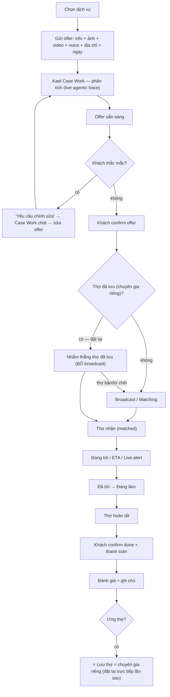
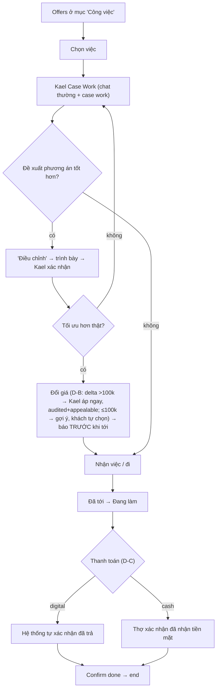
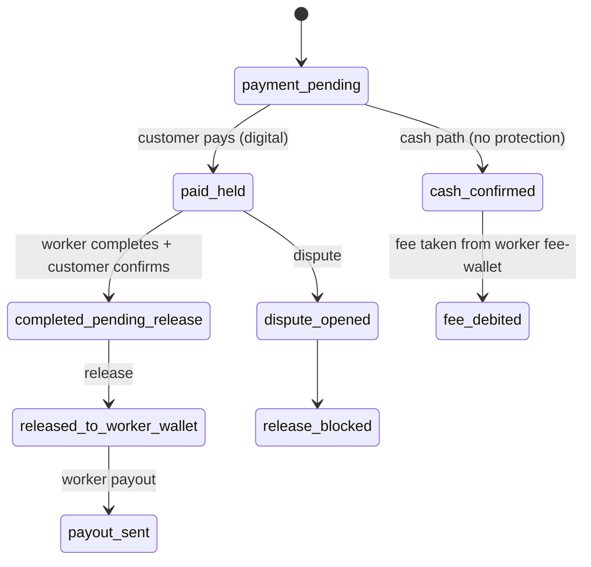

# Agentic Workflow Spec (Issue #3) — the FE↔BE process STRUCTURES.md must reflect

> **STATUS: DRAFT — PARKED. Do NOT build / do NOT edit `STRUCTURES.md` yet.**
> Tu's gate: discuss all 5 items (#1 done; #5 planned; #3 = this; #4, #2 pending) → then build everything in one pass. `STRUCTURES.md` is LOCKED — editing it (to encode this workflow) needs Tu's explicit "OK sửa" at build time.
> Source: Tu's verbal walkthrough 2026-06-16 + design boards in `nestscout-codex-handoff-final-payment-gate.zip` (`01_main_flows`, `04_kael_chat_dual_mode`, `05_worker_agentic_case_work_upgrade`, `06_payment_gate_final`, profile screens). Codex paused (token-week limit) so this is described from the design, not a running app.

- **Date:** 2026-06-16 · **Owner:** Tu + Claude
- **Goal:** define the canonical **Agentic coordination workflow** (Kael working semi-autonomously) so `STRUCTURES.md` (workflow truth + state machine + backend contracts) matches the current UI/UX. The recurring theme: **FE and BE must work together at "giao thoa" (intersection) points, flexibly.**
- **Related:** [stack-unification-plan-20260616.md](stack-unification-plan-20260616.md) (#5 — Track C contracts, §S4 payment, module map), `STRUCTURES.md` (target of edit), `docs/design/kael-chat-ux-quickwins-20260608.md`, `docs/design/kael-perceived-performance-streaming-20260604.md`.

---

## §0.5 — Principle: Progressive, phase-gated reveal (NOT all-at-once)

> Tu (2026-06-16): FE and BE do NOT "appear all at once." Because we are agentic, the experience follows an ORDER — when the user reaches a phase, ONLY that phase's components reveal, in sequence, like a professional process. This is the OPPOSITE of the AI-coding-agent habit of rendering the whole screen at once.

**Rules (bind FE rendering to BE phase):**
- Each UI component/section is **bound to a workflow phase**; it reveals when the workflow ENTERS that phase, not before.
- The **BACKEND drives the phase** (workflow state); the **FRONTEND renders only what the current phase allows** and never forces a later phase's UI early.
- Contract home already exists: `packages/shared/src/workflow/workflow-phase-context.ts` + `workflow-ui-rules.ts` + `JOB_STATUS_TO_WORKFLOW_PHASE`. **STRUCTURES.md must FORMALIZE this as the single source** — each phase → allowed components / actions / `artifact_mode`. The rebuild MUST render FROM this contract, not self-invent component visibility (component-first = shared contract; "render KHÔNG tự chế").
- Kael's live agentic trace (analyzing → vision → market → price → …) is itself a phased reveal (stage streaming), not a single dump — ties to `docs/design/kael-perceived-performance-streaming-20260604.md`.
- This applies to BOTH customer and worker Case Work, AND to the §S4 payment screens (e.g. "Đang giữ an toàn → Chờ hoàn tất → Giải ngân" reveals step-by-step).

## §1. The Agentic workflow

### Customer flow (Kael Case Work)
1. Open app → login/register → home → **choose service**.
2. Provide **info + photos + video + voice + address + booking date** (the "offer").
3. All of it is pushed into **Kael Case Work**: Kael shows its **live process + analysis** (so the customer sees what an agentic process is).
4. If the customer has questions → tap **"yêu cầu chỉnh sửa"** → opens a **normal chat INSIDE Case Work** to talk to Kael / revise the offer.
5. Customer **confirms the offer** Kael produced.
6. Enter main-flow screens (matching & AI score → options → quote → location/ETA → live job alert → job in progress). *(Tu will lightly tweak these in production for clarity; same logic.)*
7. Worker arrives → completes → customer **confirms done + pays**.
8. **Review + optional note.** If the customer is happy → Kael suggests a **⭐ "save worker"** next to the worker's profile → that worker becomes the customer's **"chuyên gia riêng" (personal expert)**.
9. **Re-booking a saved worker** (DECISION D-A): runs the **full Kael Case Work** (intake + analysis) **but SKIPS broadcast** — the saved worker is targeted directly; **the worker still accepts/declines**; if the worker is busy/declines → **fallback to normal broadcast**. Kael connects both sides directly (no broadcast signal).

### Worker flow
1. Open app → offers appear in **"Công việc"** (board screen `05`, job-selection with free slots + matching jobs + accept).
2. Select a job → pushed straight into **Kael Case Work** (has a **normal chat** + a **Case Work chat**).
3. If the worker wants to add info or **propose a more-optimal plan** → presents it via an **"điều chỉnh"** button (next to "xem chi tiết").
4. **Kael validates** the proposal; if genuinely more optimal/clearer → **updates the price for the customer if needed**, **notifies before the worker arrives**. *(This is the central coordination "giao thoa".)*
5. Worker arrives → does the work → **confirms payment received** (per §3 D-C) → then presses **confirm done** → end.
6. **"Kael hỗ trợ nhận việc"** lives in the **"Thông báo"** (notifications) section (avoids duplication, clearer logic).
7. Worker **receive-money + cash-flow view also lives in the profile** (workers keep basic features).

### Chat dual-mode (confirmed)
- **Normal chat** = always-on general assistant, NOT tied to a job.
- **Case Work chat** = per active deal/job, only shows when a case is running; uses case-scoped data/tools.
- "yêu cầu chỉnh sửa" (customer) / "điều chỉnh" (worker) open the **Case Work chat** to discuss/revise the offer.

## §1.5 — Process Maps (full picture — for Tu's review + so Claude/Codex don't guess when reading STRUCTURES.md)

> Diagrams are Mermaid (render in GitHub / VS Code / most markdown viewers). The phase table is the source of truth for **which components reveal at which backend state** (§0.5 principle). Statuses use the REAL `jobs.status` enum so there is nothing to infer.

### Map 1 — Customer journey (phase-gated)

### Map 2 — Worker journey (phase-gated)

### Map 3 — Phase → component reveal → backend state (the "appear in order, not all-at-once" contract)
| # | Phase | FE reveals ONLY this | `jobs.status` (real enum) | Notes / giao thoa |
|---|---|---|---|---|
| 1 | Intake | service picker, media/voice/address/date form | `draft` | multimodal capture |
| 2 | Kael analyzing | live agentic trace (stage stream), NO offer yet | `analyzing` (+ `kael_progress` jsonb) | giao thoa #1 (stream) |
| 3 | Offer ready | estimate card + "confirm" + "yêu cầu chỉnh sửa" | `estimate_ready` → `awaiting_customer_confirm` | allowed actions from phase-context |
| 3b | Edit (optional) | Case Work chat panel | (unchanged; chat turns) | giao thoa #2 |
| 4 | Matching | matching status + AI score (or direct-to-saved) | `broadcasting` | ⭐ direct skips broadcast |
| 5 | Matched | worker card | `worker_matched` | — |
| 6 | On the way | map / ETA / live alert | `worker_on_way` | — |
| 7 | Arrived | arrived state | `arrived` | — |
| 8 | In progress | progress + worker actions | `inspecting` / `repairing` | — |
| 9 | Plan/price adjust | delta >100k → Kael applies + notice (audited/appealable); delta ≤100k → suggestion → customer opts in | `scope_change_pending` | giao thoa #3 (D-B) |
| 10 | Completion | confirm-done + pay CTA | `completed_by_worker` → `confirmed_by_customer` | giao thoa #5 |
| 11 | Payment | pay state (digital auto / cash worker-confirm) | `payment_pending` → `paid` | D-C + §S4 |
| 12 | Review | review form + ⭐ save-worker suggestion | `reviewed` | — |

### Map 4 — Money state sync (digital path; full machine in [#5 §S4](stack-unification-plan-20260616.md))

## §2. Giao thoa points (FE + BE simultaneously — the contracts that matter most)
1. **Intake → Kael:** FE sends multimodal (photo/video/voice/address/date); BE runs the Kael pipeline; FE **streams the agentic trace** in real time (ties to perceived-perf/streaming doc).
2. **"Request edit" → chat → revise offer:** offer state ↔ conversation must stay in sync; a chat turn can change the offer.
3. **Worker "điều chỉnh" → Kael validates → price update → notify/approve customer:** BE recomputes (Kael price authority), FE updates **BOTH** worker and customer views + a notification. Bidirectional — the biggest giao thoa.
4. **⭐ Save worker → direct re-book:** BE direct-match (skip broadcast), FE shows saved workers, both sides connected directly.
5. **Completion ↔ payment ↔ confirm:** payment state gates the completion confirm (per §3 D-C + §5 §S4).

## §3. Confirmed decisions (Tu, 2026-06-16)
- **D-A — Re-book saved worker = full Case Work, skip broadcast.** Worker still accept/declines; fallback to broadcast if busy/declined.
- **D-B — Worker pre-arrival plan adjustment, threshold = 100,000đ (Tu 2026-06-16; note: INVERSE of the initial proposal).** If the Kael-validated price delta is **> 100,000đ** → Kael **applies the change immediately** (only when genuinely appropriate + Kael's calc is sound) and notifies the customer before the worker arrives. If the delta is **≤ 100,000đ** → Kael does **NOT** auto-change; it **surfaces the suggestion and lets the customer decide** whether to apply (don't disrupt over a small amount). **Safeguard (per CLAUDE.md Kael-autonomy rule):** the >100k auto-change must go through a **server-validated, audited `KaelAutonomyDecision`**, be **transparent**, and **reversible/appealable** (customer can dispute) — NOT a silent binding charge. This DIFFERS from the current on-site `decide_scope_change_atomic` (requires explicit customer accept/reject), so the unified scope-change mechanism must branch its decision rule by **(timing + delta size)**, not assume customer-approval everywhere.
- **D-C — Payment-confirm gating = digital auto / cash worker-confirms.** Digital: system knows payment happened → worker just marks done. Cash: worker confirms "cash received" before done. Matches §S4 hybrid.
- **D-D — Chat dual-mode scope confirmed** (normal = always-on general; case-work = per active deal/job; edit buttons open Case Work chat).

## §4. Map to current backend + what STRUCTURES.md must change
**Already exists (reuse):**
- Intake + Kael pipeline (createJob → intent→vision→baseline→market→synthesis).
- **Worker-proposes-plan + Kael owns final price** = the existing **scope-change + `kael_final_price_authority`** mechanism (reuse, but extend timing — see below).
- Broadcast/accept (`job_broadcasts`, `accept_broadcast_atomic`); completion/confirm/review; dual chat tables (`kael_chat_*` customer + `kael_worker_chat_*`); `notifications`.

**NEW — STRUCTURES.md workflow/state-machine + contracts must add:**
- **⭐ Saved worker + direct re-book:** new `favorite_workers` (customer_id, worker_id, created_at) + a **direct-booking branch** in the state machine (target saved worker, accept/decline, fallback-to-broadcast). New backend chain (belongs to #5 Track S, driven by this workflow).
- **Pre-arrival plan adjustment:** today scope-change is on-site; D-B adds a **pre-arrival adjust** state (after worker accepts, before arrival) with the notify-vs-approve branch (threshold). Reconcile with the existing on-site scope-change so there's ONE mechanism (per §0.5 cohesion), parameterized by timing.
- **Payment-confirm gating (D-C):** couple `job_money_state` (§S4) with completion — worker "confirm done" requires payment-confirmed (digital auto / cash worker-confirm). New transition/guard.
- **Chat dual-mode contract:** formalize normal-vs-case-work chat scoping + the "edit/adjust → Case Work chat" trigger as a workflow contract.
- **Notifications:** "Kael hỗ trợ nhận việc" surfaced via `notifications` (placement rule, not a new flow).

## §5. Open questions
- **OQ-A — RESOLVED (Tu 2026-06-16):** threshold = **100,000đ**. Delta **> 100k** → Kael auto-applies (validated/audited/appealable autonomy decision + notify before arrival); delta **≤ 100k** → Kael suggests, customer opts in. See D-B.
- **OQ-B (favorite fallback UX):** when a saved worker declines/unavailable, does Kael auto-broadcast, or ask the customer first?
- **OQ-C (express re-book):** D-A keeps full Case Work — confirm we do NOT add a lighter express path for repeat workers (keep one path for now).
- **OQ-D (cash payment + protection):** cash jobs have no money-protection (§S4) — confirm the UI clearly signals "cash = không có Bảo vệ thanh toán".

## §6. Cross-links to #5
- Contracts at every giao thoa = exactly what #5 **Track C "one contract source"** must define (no 3-place drift).
- Mobile surface grouping for these flows = #5 **C1 module map** (finalize together — avoid splitting surfaces twice).
- Payment-confirm + worker money-view = #5 **§S4** (digital/cash + worker fee-wallet + profile cash-flow view).
- `favorite_workers` + direct-rebook = new chain under #5 **Track S**.

## §7. Change log
- 2026-06-16 — Initial draft from Tu's #3 walkthrough + design boards. Confirmed D-A (re-book full Case Work skip broadcast), D-B (pre-arrival adjust tùy mức độ), D-C (payment-confirm digital-auto/cash-worker), D-D (dual-chat scope). Parked pending #4/#2 discussion + combined-build approval + STRUCTURES.md unlock.
- 2026-06-16 — Added §0.5 progressive phase-gated reveal principle (components bound to phase, revealed in order, never all-at-once; renders from `workflow-phase-context` + `workflow-ui-rules`) + §1.5 full Process Maps (Mermaid customer journey, worker journey, money-state diagram, + phase→component→`jobs.status` table) per Tu — so Tu can review and Claude/Codex don't guess when reading STRUCTURES.md.
- 2026-06-16 — OQ-A RESOLVED: D-B threshold = 100,000đ (INVERSE of initial proposal) — delta >100k → Kael auto-applies (validated/audited/appealable + notify); ≤100k → suggest, customer opts in. Updated D-B, OQ-A, Map 2 (WH), Map 3 (row 9).
