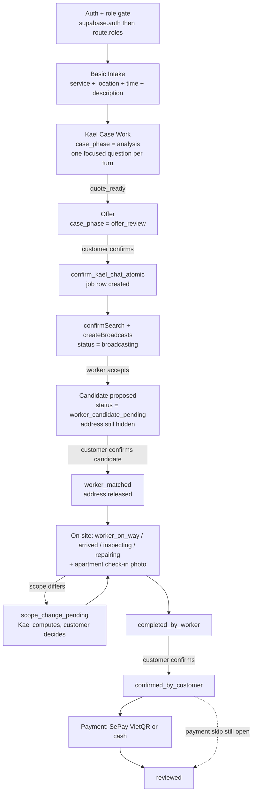

# NestScout App Structures

This file is the single source of truth for NestScout product workflow, app operation, and build direction.

AI coding agents MUST read this file before implementing frontend, backend, database, AI, admin, worker, customer, or workflow logic. This file describes the full app operation, but implementation still follows the current approved phase. It is a blueprint, not permission to build every future capability immediately.

**§1.5 is the exception: it is a status report, not a blueprint.** Read it to learn what already runs before proposing to build anything.

If this file conflicts with `RULES.md`, `critical.md`, or Tu's current instruction, stop and ask Tu for a decision before implementation.

---

## 0. How To Use This File

Use this file to answer:

- What product are we building?
- **Where is the product actually today, and what is still a plan?** -> §1.5
- Which services are in scope?
- How does the customer workflow run?
- How does the worker workflow run?
- What does Kael do?
- What must the backend support before frontend screens can work?
- Which state machines must frontend/backend share?
- **How does the app actually run, end to end, today?** -> §4.6, then §6/§7 Runtime blocks
- **What exactly executes when the customer taps confirm?** -> §6 A7
- **Which structural invariants will a gate reject me for breaking?** -> §4.5
- **What does every request share — errors, auth, realtime, media, idempotency?** -> §22
- What must not be built yet?

Rules for AI agents:

- Treat this file as the workflow source of truth.
- Do not invent new product flows that are not represented here.
- Do not convert Next.js into the consumer web product.
- React Native is the primary app surface.
- Next.js exists for backend, admin, and prototypes only.
- User-facing app text must be Vietnamese.
- Technical implementation notes may be English.
- Every money-impacting transition must be backed by a validated server-side decision, audit trail, and appeal/override path.
- Every workflow step must have loading, empty, error, success, and retry considerations when implemented.

Current phase note:

```text
The file may describe full app operation.
Implementation must still be phase-controlled.
The approved service scope is the six-service catalog in §1; do not expand beyond it or add multi-city workflows without Tu's explicit approval.
```

---

## 1. Product Identity And Hard Scope

NestScout is a mobile-first home repair platform for HCMC apartment residents.

Current service scope:

```text
Supported now
-
|- Electrical repair
|- Plumbing repair
|- Home cleaning / housekeeping
|- Air conditioning and indoor air service
|- Sofa, mattress, curtain, and carpet care
|- Minor repair and installation
|- HCMC apartments
|- Customer-to-worker matching
|- Basic Intake at the service route, then Kael Case Work for diagnosis/scope, price check, worker brief, matching, and support
```

Canonical service identifiers and Kael performance profiles:

```text
electrical -> electric_diagnose
plumbing -> water_diagnose
cleaning -> clean_scope
hvac -> air_scope
upholstery -> fabric_scope
handyman -> task_scope
```

The six profiles share one server-side Case Work spine and one phase contract. Each profile owns service-specific quote drivers, safety/capability checks, evidence guidance, completion checks, and scope-change triggers; it is not a separate client-side questionnaire or an uncontrolled collection of autonomous agents.

Out of scope now:

```text
Not supported now
-
|- Appliance repair
|- Services outside the six approved categories
|- Multi-city expansion
|- Autonomous actions from raw AI output or client-side UI
|- Payment provider execution beyond implemented rails
|- Uncontrolled multi-agent orchestration outside the validated Case Work spine
|- Consumer web app
```

If a user asks for an unsupported service, Kael must politely decline:

```text
Current meaning:
"Yêu cầu này hiện chưa thuộc phạm vi NestScout. NestScout đang hỗ trợ sửa điện, sửa nước, vệ sinh nhà cửa, điều hòa và không khí, sofa/nệm/rèm/thảm, cùng sửa vặt và lắp đặt nhỏ."
```

Kael today:

```text
Kael = phase-gated Agentic Case Work
-
|- receives Basic Intake: service, location, desired time, short description, and optional privacy-safe evidence
|- identifies the applicable service profile and builds a structured diagnosis/scope artifact
|- asks exactly one focused question per turn until the case is quote-ready
|- analyzes photos, editable on-device voice transcripts, and 1-3 locally extracted video frames
|- estimates a market price range only when validated baseline/market evidence exists
|- explains uncertainty
|- pauses for customer offer confirmation before starting matching
|- prepares worker pre-brief and searches verified, service-capable workers
|- pauses for customer confirmation of a proposed worker before final assignment
|- mediates explicit scope-change, completion, and payment confirmation gates
```

Kael is not:

```text
Kael is not
-
|- a raw-LLM status writer
|- a client-side money/payment actor
|- an unverified payment executor
|- a worker punishment system
|- a generic repair chatbot
|- a service expansion engine
```

---

## 1.5 Where The Product Actually Is

**Milestone: PR #227 (commit `1c5813b4`). Merged range: #1 -> #227.**

§1 above and §5–§22 below describe the intended product. This section describes what exists today. When the two disagree, this section is the fact and the rest is the target.

Status vocabulary — every claim is anchored to the PR that delivered it, so `git log --pretty="%s" | grep "#<n>"` verifies it. That check needs **full history**: a shallow clone (CI, and the remote agent environments) truncates the log, and every anchor older than the graft point reads as unresolvable. Run `git rev-parse --is-shallow-repository` before concluding an anchor is dead — deleting a valid one because the clone could not see it is the failure this note exists to prevent.


```text
RUNNING (#n)              - code exists and is covered by tests or a recorded run
PARTIAL (#n, missing X)   - code exists, the gap is named
NOT BUILT                 - blueprint only, no runtime code
```

### 1.5.1 Surface inventory

Every number below carries the command that regenerates it. **A count with no command is not evidence.** This rule exists because the previous inventory claimed 97 `mobile-api` route kinds while the tree held 114, and nobody could tell which was wrong. It applies to the command too: a command that cannot reproduce the number beside it is the same defect wearing evidence, which is how the SQL row below sat wrong for a full milestone.

| Surface | Count | Regenerate with |
|---|---|---|
| Expo Router route files | 31 | `git ls-files apps/mobile/app \| grep -v __tests__ \| wc -l` |
| `mobile-api` route kinds | 173 | `grep -rhoE 'kind: "[^"]+"' supabase/functions/mobile-api/_shared/http/routes \| sort -u \| wc -l` |
| ...of which dispatched | 171 | same over `_shared/http/dispatch` with `case "[^"]+"` |
| Edge `_shared` source files | 383 | `git ls-files supabase/functions/mobile-api/_shared \| wc -l` — split http 49 / domains 168 / kael 135 / platform 26 (§4.5) |
| Deployable Edge functions | 7 | `git ls-files supabase/functions \| awk -F/ 'NF>2 && $3!="_shared"{print $3}' \| sort -u \| wc -l` |
| Migrations | 287 | `git ls-files 'supabase/migrations/*.sql' \| wc -l` |
| `public` tables / views / functions | 129 / 9 / 183 | the `--count` command below |
| Test suites (api / mobile / shared) | 323 / 145 / 28 | `git ls-files <package> \| grep -cE '[-.]test\.tsx?$'` |
| SQL verification tests | 54 | `git ls-files 'supabase/tests/*.sql' \| wc -l` |

```bash
node scripts/split-database-types.mjs --count
```

The two undispatched route kinds are the public ones, `kael.charter` and `harness.health` — both declared `public: true` and handled in `routes/index.ts` rather than through `dispatch`. `harness.health` needs no auth and answers deployment identity, which is what makes it usable as a parity probe.

Three counting traps, all of which have produced wrong numbers here before:

- Mobile suites use **two** naming conventions — `*-test.ts(x)` and `*.test.ts` (under `apps/mobile/lib/__tests__`). Counting only the `.test.` form makes the app look untested; hence the `[-.]` in the command above.
- SQL verification tests are **not** `*.test.ts` and never were. They are `supabase/tests/*.sql`, so the JS pattern returns 1 and hides 53 of them. They get their own row and their own command.
- The generated artifact declares members in three shapes — `name: {` over several lines, `name: { Args: …; Returns: … }` on one line, and `name:` followed by a multi-line union (the three `*_kael_ai_spend` RPCs). A regex keyed on `name: {` silently drops the last two, and one keyed on the file as a whole also picks up `graphql` from the separate `graphql_public` schema. The function count above counts by brace depth inside `public` only, so it excludes `graphql` and includes all three shapes.

### 1.5.2 Capability status

`Lives in` names the folder that owns the capability, so a status claim can be checked against the tree instead of trusted. Paths are relative to `supabase/functions/mobile-api/_shared/` unless stated.

| Capability | Status | Lives in |
|---|---|---|
| Auth, profile, account lifecycle | RUNNING (#10 foundation, #126 simplified registration, #143 auth hardening, #139 account deletion, #224 auth shell refresh hardening) | Supabase Auth + `domains/customer/**` (9), `domains/worker/registration.ts` |
| Six-service taxonomy + Basic Intake | RUNNING (#110 six-service Case Work foundation) | `domains/catalog/catalog.ts` (1), `packages/shared/src/service-intake/**` (4) |
| Kael Case Work pipeline (intent -> knowledge -> baseline -> synthesis) | RUNNING (#37 pipeline/orchestrator, #84 agentic harness, #142 agentic production flow, #144 layer split, #198 evidence-backed agentic job flow) | `kael/pipeline/**` (16), `kael/tools/**` (9), `kael/agents/**` (20) |
| Kael provider layer: routing, circuit breaker, spend budget, batching | RUNNING (#37 `routing.config.ts`, #138 role-based subfolders, #214 identity-only provenance per model call) | `kael/kael-providers/**` (10), `kael/kael-guardrails/**` (22) |
| Job lifecycle + state machine | RUNNING (#7 workflow alignment) | `domains/job/**` (41), `platform/lifecycle.ts`, `workflow-orchestrator.ts` |
| Matching + broadcast (atomic accept, retry claims) | RUNNING (#7, #144) | `domains/matching/**` (20) + the `kael-matching-maintainer` Edge function |
| Chat, media evidence, realtime | RUNNING (#29 realtime) | `domains/job/{chat,media,evidence-refs,incident}*.ts` (14); `chat_messages`, `job_media_assets`, `evidence_snapshots` |
| Scope change (request -> command -> effect) | RUNNING (#7) | `domains/job/scope-change/**` (13) |
| Completion + review | RUNNING (#197 finance and review workflows) | `domains/payment/completion-review.ts`, `reviews` |
| Dispute (open, counter-statement, admin decision) | RUNNING (#37) | `domains/dispute/dispute.ts` — one file |
| Kael evidence-gated learning | RUNNING (#7 candidate tables, #124 loop learning) | `kael/learning/**` (32) + the `kael-learning-monitor` Edge function |
| Notifications + push tokens | RUNNING | `domains/notification/**` (4), `device_push_tokens` |
| Worker self-service: register, verification upload, availability | RUNNING (#109 availability guard, #186 worker payout controls, #190 production worker access) — admin approval now happens **inside** the app through `admin.workerApplications.*`, which retires the previous "approval happens outside the app" gap | `domains/worker/**` (21) |
| Admin controls | PARTIAL (#186 admin operations + worker payout controls, #188 admin controls, payouts, preview safety, #190 production worker access) — the surface grew from 8 `admin.*` route kinds in one file to **53 across 16**, of which **25 mutate and 28 are read-only**. Against §3's thirteen duties: **8 RUNNING** (approve workers; inspect AI logs and failures; roll back learned Kael rules; finance reporting and tax policy; payout methods and withdrawals; reconciliation and transaction ledger; sub-admin provisioning, nomination and access; operations dashboard and actor lookup). **2 read-only** — manage price baselines and review support/disputes are `GET` only (`admin.governance.priceBaselines`, `admin.governance.disputes`), and the dispute decision path lives in `domains/dispute/dispute.ts`, not an `admin.*` route. **3 with zero matching routes** — review jobs, monitor scope changes, manage service taxonomy. The read-only two are graded down because their duty verb is *manage* / *review* while only `GET` exists; the operations-dashboard and actor-lookup duties are read verbs, so `GET` satisfies them and they count as RUNNING | `domains/admin/**` (16) |
| Payments | PARTIAL (#135 SePay VietQR intent + webhook, #139 cash confirm + commission ledger, #192 protected direct payment eligibility, #197 finance and review workflows) — no real transaction has been processed, and the status table in `platform/lifecycle.ts` still allows `confirmed_by_customer -> reviewed` (`:23`), so the Phase-0 payment skip is **not closed** even though rails exist. The gate is the composition of that table with `WORKFLOW_EVENT_TRANSITIONS` in `workflow-orchestrator.ts` (`:152`), which restricts the skip to `kael_decided_dispute`; reason about it from both tables, never `lifecycle.ts` alone | `domains/payment/**` (7: `cash`, `sepay-vietqr`, `commission`, `completion-review`, `direct-payment-availability`, `manual-bank`, `staging`) + the `sepay-webhook` and `payment-maintainer` Edge functions |
| Worker map | PARTIAL (#215) — `apps/mobile` now depends on `@vietmap/vietmap-gl-react-native` 3.0.0 and renders real map surfaces (worker home stage, route, service area), which retires the earlier "no map SDK, so the surfaces are SVG" claim. Still PARTIAL: one surface is still named `worker-interactive-route-map-prototype.tsx`, and `map-proxy-spike` remains a spike that is nonetheless deployed to production | `apps/mobile/components/worker/**` (10 files reference the SDK) + `supabase/functions/map-proxy-spike` |
| Actor stats / gamification | PARTIAL — **write-only**, unchanged since the last milestone. The production cron `recompute-actor-stats-daily` does run, so the tables are populated; the defect is that **no `apps/mobile` or `supabase/functions` source reads them**, re-verified at this milestone by grepping the three table names across both trees and finding zero hits | `20260619151536_worker_customer_stats.sql` (#70); zero readers |
| Consumer web app | NOT BUILT — deliberately out of scope per §1 |  |

### 1.5.3 Frontier

The PARTIAL rows are where the next backend work belongs; the RUNNING rows are not. Ordered by what actually blocks a first real transaction:

```text
1. Payments      - rails exist, no money has moved, and the lifecycle payment skip is still open
2. Device proof  - Expo SDK 57 has never run on real hardware from this repo, and the current
                   release decision is NO-GO
3. Admin         - of §3's 13 duties: 8 running, 2 read-only, 3 with no route at all
4. Actor stats   - written daily, read nowhere; either wire a reader or stop writing
```

Known-unverified at this milestone. State these plainly; do not let a green JS gate stand in for them:

```text
Expo SDK 54 -> 57 (#132)  - JS gates green (type-check + mobile suites). Never run on a
                            real device or simulator from this repo.
Payment rails             - code and tests only. "No money has moved" is a business fact this
                            repository cannot prove in either direction; it is carried from
                            the milestone and only Tu can retire it, never a gate.
Store readiness           - a build reached Apple App Review and was REJECTED; iOS Builds 43
                            and 44 followed as hardening work. The recorded decision is
                            NO-GO (docs/test-logs/2026-08-22_build44-apple-review-hardening.md):
                            Build 44 not yet created or processed, target deployment proof
                            outstanding, native iPhone/iPad matrix pending. No TestFlight or
                            Play internal validation is recorded.
```

Refreshing this section: run `git log 1c5813b4..HEAD --pretty="%s" | grep -E "^#|^Merge pull request #"` for the new PRs, re-run the §1.5.1 commands, re-check the rows those PRs touch, and move the milestone line to the newest PR. The `^Merge pull request #` half is not optional — at the previous milestone 12 of 40 PRs merged in that form, `#215` among them, and a `^#`-only grep hid every one.

---

## 2. Competitor-Derived Product Principles

We learn from apps that already operate in home services, but we do not copy their full complexity. bTaskee, JupViec, Rada, 246SHOME, Urban Company, and Taskrabbit are references for product patterns, not the product spec.

Adopt these patterns:

```text
Good patterns to adopt
-
|- fast booking path
|- transparent estimate before booking
|- worker verification and profile trust
|- clear audit, override, and appeal paths for money-impacting actions
|- in-app chat as the source of truth
|- photo/video evidence before and after job
|- rating and feedback loop
|- support/admin review path
|- cancellation and rebooking handling
|- worker earning transparency
|- customer sees enough trust signals before accepting service
```

Avoid these patterns:

```text
Bad patterns to avoid
-
|- overloaded service catalog
|- unclear address handling
|- hidden price changes
|- scope change without Kael policy decision, evidence, and appeal path
|- weak support resolution
|- no transaction evidence trail
|- slow, heavy, confusing app flow
|- too many user decisions before the first useful estimate
|- pretending price is exact when it is only an estimate
```

Product principle:

```text
Copy the validated shape.
Remove what is heavy or unclear.
Adapt it to the six approved services and the same phase-gated Case Work contract.
Keep the path to the first real transaction short.
```

---

## 3. App Roles And Surfaces

### Customer

The customer is an HCMC apartment resident who needs one of the six supported services, wants a fair evidence-backed estimate, and wants a trustworthy worker.

Customer app responsibilities:

```text
Customer app
-
|- collect Basic Intake only: service, location, desired time, short description, and optional media
|- hand the case to Kael for one-question-at-a-time analysis
|- show the structured Kael diagnosis/scope and estimate
|- collect explicit offer and proposed-worker confirmation
|- show Kael orchestration and audit trail
|- show worker match
|- support in-app chat
|- provide scope-change evidence and explicit confirmation/appeal
|- provide completion evidence and explicit confirmation/appeal
|- show payment only when an implemented rail and real payment state exist
|- collect review
```

### Worker

The worker is a verified service provider approved manually by admin.

Worker app responsibilities:

```text
Worker app
-
|- register and submit verification
|- upload identity/selfie files into the private worker-verification storage box
|- toggle availability
|- receive incoming job request
|- accept or skip within countdown
|- view full job details after accept
|- update job status
|- chat with customer
|- report scope change
|- submit completion evidence
|- view earnings
```

### Admin

Admin is the operational control surface. Admin does not need to handle every learning event, but must be able to review, override, and roll back high-risk outcomes.

Admin responsibilities:

```text
Admin panel
-
|- approve workers
|- review jobs
|- manage price baselines
|- inspect AI logs and failures
|- monitor scope changes
|- review support/disputes
|- manage service taxonomy
|- view and roll back learned Kael rules
|- run finance reporting and the tax-policy lifecycle (draft -> approve -> retire)
|- decide worker payout methods and resolve withdrawal requests
|- reconcile payments and inspect the transaction ledger
|- provision sub-admins, nominate managers, and grant or revoke their access
|- read the operations dashboard and look up any actor
```

Every money-moving admin action — a payout-method decision, a withdrawal resolution, a payment reconciliation, a tax-policy approval or retirement — is an explicit, logged decision taken by a named admin actor against a specific record. None of it is automatic, none of it is batched behind a single confirmation, and none of it is Kael's to take: Kael may surface and recommend, an admin decides. Where each of these duties actually stands is §1.5 and nowhere else.

### Kael

Kael is the AI reasoning layer for price checking, problem analysis, clarification, worker pre-briefs, and evidence-gated self-learning.

Kael responsibilities:

```text
Kael
-
|- classify intent
|- enforce service scope
|- select the service performance profile
|- analyze privacy-safe text/media and build the diagnosis/scope artifact
|- ask one focused question per turn until quote-ready
|- search market price only when a source-backed lookup is available
|- synthesize a structured estimate or an honest not-ready state
|- stop at offer, proposed-worker, scope-change, completion, and payment gates
|- create advisory only when justified
|- generate worker pre-brief
|- explain scope change
|- learn from completed jobs through evidence gates
```

### Support / Operator

Support may be handled by admin initially.

Support responsibilities:

```text
Support
-
|- investigate disputes
|- inspect chat/evidence
|- handle worker no-show
|- help with failed payment
|- help with failed matching
|- review flagged fraud or overcharge patterns
```

---

## 4. Build Order Blueprint

Build backend foundations before frontend polish. Screens without state machines and backend contracts create fragile code.

This is the **dependency order**, not a status board. Where each item actually stands lives in §1.5 and nowhere else — a status repeated in two places drifts in two places.

```text
Foundation order
-
|- 1.  Auth + profiles
|- 2.  Service taxonomy
|- 3.  Price baselines
|- 4.  Kael AI wrapper + output schemas
|- 5.  Job lifecycle
|- 6.  Customer price-check flow
|- 7.  Worker verification + availability
|- 8.  Matching + broadcast
|- 9.  Chat + evidence
|- 10. Scope change
|- 11. Completion + review
|- 12. Admin controls
|- 13. Learning candidates and evidence gates
|- 14. Payments integration
```

Price baselines (3) are read-path only: there is no in-app write/management surface, so the order above still holds for anything new built on top of them.

Frontend should follow stable backend contracts:

```text
Frontend build order
-
|- Customer auth/profile
|- Customer home
|- Six-service Basic Intake
|- Kael one-question-at-a-time analysis + diagnosis/scope artifact
|- Kael estimate + customer offer confirmation
|- Searching/matching status
|- Proposed-worker confirmation
|- Active job
|- Scope-change confirmation
|- Completion confirmation
|- Implemented payment rail
|- Review
|- Worker app surfaces
|- Admin panel surfaces
```

Backend-first rule:

```text
If a screen needs persistent state, permissions, or AI output,
define the backend contract before building final UI.
```

---

## 4.5 Runtime And Structure Invariants

These are structural rules the repository enforces mechanically: breaking one fails a gate, not a review. This section carries the invariants only. Which file owns which behavior is **not** here — that is [`docs/architecture/code-ownership-map.md`](../docs/architecture/code-ownership-map.md), and duplicating it here would create a second ownership map that drifts.

### Edge layer model

Inside `supabase/functions/mobile-api/_shared/`, dependencies run one way:

```text
http/   ->   domains/   ->   kael/   ->   platform/
 41           126            120           21        files (§1.5.1)
```

- `http/` — route matching, dispatch, role guards, DTO validation, response envelope.
- `domains/` — workflow reads/writes, DB/RPC/Storage, matching, notifications. 12 folders.
- `kael/` — Edge Kael pipeline, providers, guardrails, learning. 12 folders.
- `platform/` — cross-cutting: `lifecycle.ts`, `access.ts`, `rate-limit.ts`, `push.ts`, `db.ts`, `edge-env.ts`, audit and error mapping.

A layer may reach the layers below it, never above. `http/` additionally may not reach `kael/` directly: an endpoint that talks to the brain with no use-case in between is how workflow rules get bypassed.

### Runtime boundary and the second brain

- No `apps/mobile/**` or `supabase/functions/**` source may import `apps/api`. The Edge `kael/**` is the canonical Kael brain.
- `apps/api/src/lib/{kael,learning}/**` is non-canonical Next.js reference/parity and is **frozen**: it may shrink or stay, never grow. A new file there — or a longer one — means the second brain is being extended instead of the Edge one.

### Contract twins are design, not rot

Deno cannot import `packages/shared`, so the request/response contracts exist as two hand-maintained twins:

```text
supabase/functions/_shared/contracts/**   <->   packages/shared/src/contracts/**
```

Drift fails the contract-parity tests in `packages/shared/src/__tests__/`. A consequence worth knowing before you "clean up" anything: several files are one to three lines **on purpose**. `packages/shared/src/mobile-workflow.ts`, `packages/shared/src/validation.ts`, and `_shared/kael.ts` are facades that preserve a public import surface after the real code moved into a folder of the same name. Deleting a facade breaks every importer.

### File and type ratchets

- No source file over 800 lines, and no already-oversize file may grow. Today's exceptions are listed in `scripts/structure-baseline.json`.
- One concept = one home: an exported type or interface name may not be newly re-declared in a second file.
- Never run `lint-structure.mjs --init` to make a failure go away. It re-grandfathers whatever is oversize at that moment and silently lifts the ratchet for the whole repo.

### The gates

| Gate | Enforces |
|---|---|
| `pnpm lint:structure` | layer model, runtime boundary, frozen paths, 800-line cap, one-concept-one-home |
| `pnpm lint:comments` | comment discipline (`governance/protocols/code-hygiene.md`); also a Stop hook and a CI job |
| `pnpm skills:check` | `.claude/skills` <-> `.agents/skills` parity |
| `pnpm type-check:*` / `pnpm test:*` | per-package types and suites (§20) |

---

## 4.6 App Operation At A Glance

One screen for "how does this app actually run?". Every box below is traced function-by-function in the spokes named beside it.



The twelve things worth knowing before reading any spoke:

```text
1.  Mobile never writes workflow state. Everything sensitive goes through
    the mobile-api Edge function (RULES.md #0).
2.  There are TWO entry paths: Kael-first (primary) and direct createJob.
    Both end at `broadcasting`.                                    -> §6
3.  The job row is created at CONFIRM time on the primary path, not
    when the conversation starts.                                  -> §6 A7
4.  Accepting a broadcast proposes a CANDIDATE. It does not assign the
    job and does not release the address.                          -> §7.0.1
5.  `jobs.worker_id` is written in exactly one function:
    confirmWorkerCandidate.                                        -> §6 A9
6.  Every status change is driven by an EVENT, checked twice: the event
    must allow the pair, and lifecycle.ts must allow it too.       -> §12.3
7.  Kael can move the workflow only through a validated
    KaelAutonomyDecision - schema, action/event match, then pair.  -> §12.5
8.  Three state vocabularies run in parallel: jobs.status (18),
    WorkflowPhase (19), case_phase (11 declared / 3 reachable).    -> §12.1
9.  The Kael pipeline has seven stages, not four.                  -> §9.5.1
10. Guardrails fail closed: a trip returns a safe Vietnamese
    template plus an audit row, never a blank success.             -> §9.5.2
11. Workflow writes are compare-and-set on the previous status, so a
    concurrent change returns STATUS_CHANGED instead of corrupting. -> §22.2
12. Learning is queued, never inline - a slow learning path can never
    break a booking.                                               -> §22.11
```

---

## Detailed Contracts (spokes)

§5–§21 are extracted into `governance/structures/*` for progressive disclosure. Load only the spoke your task needs; each spoke keeps its original section number. The hub above (§0–§4) plus this table is enough to navigate.

| § | Domain | Spoke |
|---|---|---|
| 5 | Six-service taxonomy and performance-profile mapping | [`structures/service-taxonomy.md`](structures/service-taxonomy.md) |
| 6 | Customer workflow part 1 (A0–A7): intake -> matching start. Also owns §6.0 / §6.0.1 | [`structures/customer-workflow.md`](structures/customer-workflow.md) |
| 6 | Customer workflow part 2 (A8–A14): matching -> review | [`structures/customer-workflow-fulfillment.md`](structures/customer-workflow-fulfillment.md) |
| 7 | Worker workflow (B0–B8) | [`structures/worker-workflow.md`](structures/worker-workflow.md) |
| 8 | Admin workflow | [`structures/admin-workflow.md`](structures/admin-workflow.md) |
| 9 | Kael workflow | [`structures/kael-workflow.md`](structures/kael-workflow.md) |
| 9A | Agentic coordination workflow / Case Work | [`structures/agentic-coordination-workflow.md`](structures/agentic-coordination-workflow.md) |
| 10 | Kael evidence-gated self-learning | [`structures/kael-learning.md`](structures/kael-learning.md) |
| 11 | Backend domain model | [`structures/backend-domain-model.md`](structures/backend-domain-model.md) |
| 12 | State machines | [`structures/state-machines.md`](structures/state-machines.md) |
| 13 | Matching & broadcast rules | [`structures/matching-broadcast.md`](structures/matching-broadcast.md) |
| 14 | Trust, safety & evidence | [`structures/trust-safety-evidence.md`](structures/trust-safety-evidence.md) |
| 15 | Pricing, fees & scope change | [`structures/pricing-fees-scope.md`](structures/pricing-fees-scope.md) |
| 16 | Notifications | [`structures/notifications.md`](structures/notifications.md) |
| 17 | Cancellation, reschedule & failure recovery | [`structures/cancellation-recovery.md`](structures/cancellation-recovery.md) |
| 18–20 | Frontend / backend / testing build contracts | [`structures/build-contracts.md`](structures/build-contracts.md) |
| 21 | Do not build now | [`structures/do-not-build-now.md`](structures/do-not-build-now.md) |
| 22 | Cross-cutting runtime: request lifecycle, errors, realtime, notifications, media, rate limit, idempotency, audit | [`structures/runtime-crosscutting.md`](structures/runtime-crosscutting.md) |

---

## 5. Service Taxonomy

> Moved to [`structures/service-taxonomy.md`](structures/service-taxonomy.md). Six-service taxonomy, Case Work profile mapping, and taxonomy rules.

## 6. Customer Workflow

> Split across two spokes. [`structures/customer-workflow.md`](structures/customer-workflow.md) holds the step contract, the workflow illustration, §6.0 (Contract vs Runtime blocks), §6.0.1 (the two entry paths), and **A0–A7** through the confirmed offer that starts matching. [`structures/customer-workflow-fulfillment.md`](structures/customer-workflow-fulfillment.md) holds **A8–A14** from the running search to review. The seam is where the job row exists and `jobs.status = broadcasting`.

## 7. Worker Workflow

> Moved to [`structures/worker-workflow.md`](structures/worker-workflow.md). Worker workflow illustration + B0–B8.

## 8. Admin Workflow

> Moved to [`structures/admin-workflow.md`](structures/admin-workflow.md). Admin workflows and human control points.

## 9. Kael Workflow

> Moved to [`structures/kael-workflow.md`](structures/kael-workflow.md). Kael artifact lifecycle, price-check flow, AI provider roles, structured output.

## 9A. Agentic Coordination Workflow

> Moved to [`structures/agentic-coordination-workflow.md`](structures/agentic-coordination-workflow.md). Case Work phase-gated reveal, saved-worker direct re-booking, dual chat, pre-arrival scope timing, payment-confirm gating, and giao thoa points.

## 10. Kael Evidence-Gated Self-Learning System

> Moved to [`structures/kael-learning.md`](structures/kael-learning.md). MarketMemory + CaseReview, evidence gate, learned-rule example, forbidden effects (10A–10F).

## 11. Backend Domain Model

> Moved to [`structures/backend-domain-model.md`](structures/backend-domain-model.md). Backend modules, module contracts, and backend hard rules.

## 12. State Machines

> Moved to [`structures/state-machines.md`](structures/state-machines.md). Job / broadcast / scope / verification / payment / learning / notification state machines.

## 13. Matching And Broadcast Rules

> Moved to [`structures/matching-broadcast.md`](structures/matching-broadcast.md). Worker eligibility, broadcast behavior, pre-accept visibility, failure rules.

## 14. Trust, Safety, And Evidence

> Moved to [`structures/trust-safety-evidence.md`](structures/trust-safety-evidence.md). Trust signals, worker verification, evidence trail, chat conduct, PII rules.

## 15. Pricing, Fees, And Scope Change

> Moved to [`structures/pricing-fees-scope.md`](structures/pricing-fees-scope.md). Pricing principles, fees/commission, scope-change flow, forbidden pricing behavior.

## 16. Notifications

> Moved to [`structures/notifications.md`](structures/notifications.md). Customer / worker / admin notification events and rules.

## 17. Cancellation, Reschedule, And Failure Recovery

> Moved to [`structures/cancellation-recovery.md`](structures/cancellation-recovery.md). Failure recovery, cancellation moments, reschedule, dispute flow.

## 18. Frontend Build Contract

> Moved to [`structures/build-contracts.md`](structures/build-contracts.md). Frontend contract, implementation ownership, navigation, screen + mobile rules.

## 19. Backend Build Contract

> Moved to [`structures/build-contracts.md`](structures/build-contracts.md). Backend contract, server responsibilities, client-forbidden list, idempotency.

## 20. Testing Blueprint

> Moved to [`structures/build-contracts.md`](structures/build-contracts.md). Testing layers, workflow test areas, critical / security / AI test cases.

## 21. Do Not Build Now

> Moved to [`structures/do-not-build-now.md`](structures/do-not-build-now.md). Over-engineering boundary, allowed-in-docs, Kael learning exception, current priority.

## 22. Cross-Cutting Runtime

> In [`structures/runtime-crosscutting.md`](structures/runtime-crosscutting.md). The mechanics every request shares: request lifecycle, error envelope and code vocabulary, auth/role gating, realtime channels, notifications and push, media and storage, rate limit and spend control, idempotency, audit trail, SSE, and the learning queue.
