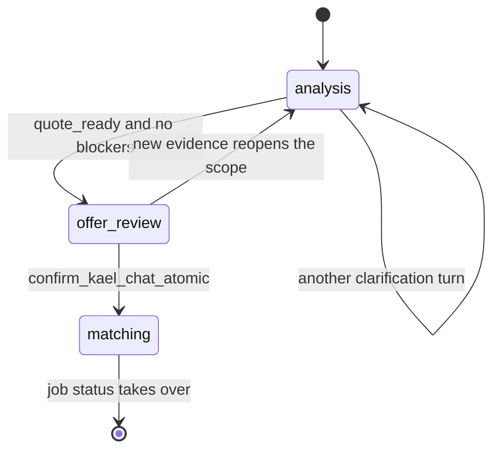

# Structures Spoke - Agentic Coordination Workflow

> Extracted from `STRUCTURES.md` section 9A after the #70 stack-unification work. Load this spoke for Case Work phase-gated reveal, saved-worker direct re-booking, dual chat, pre-arrival scope-change timing, and payment-confirm gating. `RULES.md` and `critical.md` remain higher authority; if this conflicts with them or with Tu, stop and ask.

## Agentic Coordination Workflow (Case Work)

Kael runs the customer and worker journeys as one agentic coordination process ("Case Work"): Basic Intake and worker proposals flow through Kael, which analyzes, prices, validates, and notifies both sides at defined intersection ("giao thoa") points. This section is the current workflow truth. Older architecture process maps are historical support material and must be reconciled to this updated phase/gate contract before implementation. Frontend and backend cooperate at giao thoa points, and the backend always drives the phase.

#### Phase-Gated Reveal (appear in order, not all-at-once)

```text
Phase-gated reveal
-
|- each UI component is bound to a workflow phase
|- a component reveals only when the workflow ENTERS its phase, never earlier
|- the BACKEND drives the phase (workflow state); the FRONTEND renders only what the current phase allows
|- the frontend never forces a later phase's UI early
|- Kael's live agentic trace (analyzing -> vision -> market -> price) is itself a phased reveal (stage streaming), not a single dump
|- applies to customer Case Work, worker Case Work, and payment screens
```

Single source of truth for phase -> allowed components / actions / `artifact_mode`: `packages/shared/src/workflow/workflow-phase-context.ts` + `workflow-ui-rules.ts` + `JOB_STATUS_TO_WORKFLOW_PHASE`. The rebuild MUST render from this contract and must not self-invent component visibility ("render không tự chế").

#### Customer Case Work Flow

```text
Customer Case Work
-
|- open app -> login/register -> home -> choose service
|- route collects Basic Intake only: service + location + desired time + short description + optional chips/media
|- Basic Intake is pushed into Kael Case Work; Kael selects one service performance profile and shows its live process + analysis (stage stream)
|- Kael asks exactly one focused question per turn and updates the diagnosis/scope artifact until quote-ready
|- analysis may accept photos, editable on-device voice transcript, and 1-3 locally extracted video frames; raw audio/video never reaches an AI provider
|- if the customer has questions -> tap "yêu cầu chỉnh sửa" -> opens a Case Work chat to revise the offer with Kael
|- Kael produces an evidence-backed offer; customer explicitly confirms it before matching
|- worker search runs; an accepting worker is a candidate, not a final assignment
|- customer explicitly confirms the proposed worker before exact-address release, final match, or on-the-way state
|- main-flow screens: matching -> candidate confirmation -> location/ETA -> live job alert -> job in progress
|- any scope change stops for explicit customer confirmation
|- worker completes -> customer explicitly confirms done -> payment phase appears -> customer pays through an implemented rail
|- review + optional note; if happy -> Kael suggests "⭐ lưu thợ" -> that worker becomes the customer's "chuyên gia riêng" (personal expert)
|- re-booking a saved worker runs full Case Work but targets that worker first; both worker acceptance and customer candidate confirmation still apply
```

#### Worker Case Work Flow

```text
Worker Case Work
-
|- offers appear in the "Công việc" board (free slots + matching jobs + accept)
|- accept a job -> worker becomes a candidate and waits for customer confirmation
|- after customer confirmation, the job is pushed into worker Case Work (normal chat + Case Work chat) and exact address may be revealed
|- to add info or propose a more-optimal plan -> "điều chỉnh" button (next to "xem chi tiết")
|- Kael validates the proposal and computes any price change -> customer explicitly confirms before changed work continues (central giao thoa)
|- worker arrives -> does the work -> submits completion evidence -> customer confirms completion -> payment proceeds
|- "Kael hỗ trợ nhận việc" lives in the "Thông báo" (notifications) section
|- worker receive-money + cash-flow view lives in the profile
```

#### Chat Dual-Mode

```text
Chat dual-mode
-
|- normal chat = always-on general assistant, NOT tied to a job
|- Case Work chat = per active deal/job, only shows when a case is running; uses case-scoped data/tools
|- "yêu cầu chỉnh sửa" (customer) / "điều chỉnh" (worker) open the Case Work chat
```

#### Phase -> Component -> Job Status Contract

The frontend reveals only the current phase's components; `jobs.status` is the real enum that drives the phase.

| # | Phase | FE reveals only | `jobs.status` | Giao thoa |
|---|---|---|---|---|
| 1 | Basic Intake | service, location, desired time, short description, optional chips/media | `draft` | privacy-safe multimodal capture |
| 2 | Kael analyzing | live agentic trace + one focused question + evidence input; no offer yet | `analyzing` (+ `kael_progress` jsonb) | #1 (stream) |
| 3 | Offer confirmation | diagnosis/scope + estimate + "confirm" + "yêu cầu chỉnh sửa" | `estimate_ready` -> `awaiting_customer_confirm` | hard gate |
| 3b | Edit (optional) | Case Work chat panel | (unchanged; analysis chat turns) | #2 |
| 4 | Matching | matching status (or saved-worker target) | `broadcasting` | starts only after offer confirm |
| 5 | Candidate confirmation | proposed worker card + trust signals + confirm/decline | `worker_candidate_pending` | hard gate |
| 6 | Matched | confirmed worker card | `worker_matched` | exact address may now be released |
| 7 | On the way | map / real ETA / live alert | `worker_on_way` | no fabricated ETA |
| 8 | Arrived | arrived state | `arrived` | — |
| 9 | In progress | progress + worker actions | `inspecting` / `repairing` | — |
| 10 | Scope change | old/new scope, Kael-computed delta, confirm/reject/appeal | `scope_change_pending` | hard gate |
| 11 | Completion confirmation | completion evidence + confirm/dispute | `completed_by_worker` -> `confirmed_by_customer` | hard gate |
| 12 | Payment | real available payment rail + explicit pay/verified result | `payment_pending` -> `paid` | hard gate |
| 13 | Review | review form + ⭐ lưu thợ suggestion | `reviewed` | — |

#### Giao Thoa (Intersection) Points

```text
Giao thoa (FE + BE together)
-
|- 1 Basic Intake -> Kael: FE sends the minimum fields plus privacy-safe evidence; BE runs the selected profile; FE streams the agentic trace and one-question-at-a-time analysis
|- 2 "Request edit" -> chat -> revise offer: offer state <-> conversation stay in sync; a chat turn can change the offer
|- 3 Offer confirm -> matching: customer confirmation is persisted and audited before the validated matching transition
|- 4 Worker accepts -> candidate confirm: BE holds the candidate; FE shows trust evidence; customer confirm/decline controls final assignment
|- 5 Worker "điều chỉnh" -> Kael validates -> customer confirms: BE recomputes (Kael price authority), FE updates BOTH worker and customer views; changed work stays blocked
|- 6 ⭐ save worker -> targeted re-book: BE targets the saved worker first, then still requires worker acceptance and customer candidate confirmation
|- 7 Completion confirm -> payment: customer completion confirmation is persisted before the real payment phase can open
```

#### Agentic Coordination Decisions (Tu, updated 2026-07-11)

```text
Decisions
-
|- D-A re-book saved worker = full Case Work and target that worker first; worker accepts/declines, customer confirms the candidate, then fallback behavior follows the matching policy
|- D-B every money- or work-impacting pre-arrival/on-site scope change is a hard customer-confirmation gate; no amount threshold may auto-apply it
|- D-C completion confirmation precedes payment: worker submits evidence -> customer confirms/disputes -> validated completion decision -> payment phase -> explicit pay/verified callback
|- D-D chat dual-mode scope confirmed (normal = always-on general; Case Work = per active deal/job; edit buttons open Case Work chat)
|- D-E Basic Intake stays lightweight; all deeper service-specific questioning happens in Kael Case Work, one focused question per turn until quote-ready
|- D-F raw voice never leaves the device and raw video never goes to an AI provider; voice becomes editable on-device text and video becomes 1-3 local frames, while an original video may remain private human evidence
```

#### Agentic Workflow Backend Deltas

```text
Reuse vs new
-
|- extend: Basic Intake -> six-profile Kael pipeline -> versioned diagnosis/scope artifact -> clarification loop -> evidence-backed offer
|- extend: private photo access + editable voice transcript + extracted video-frame evidence; raw audio/video excluded from model input
|- reuse: worker-proposes-plan + Kael owns price computation = existing scope-change + kael_final_price_authority, with explicit customer confirmation before mutation
|- reuse: broadcast/accept (job_broadcasts, accept_broadcast_atomic); completion/confirm/review; dual chat tables; notifications
|- NEW candidate-confirmation state between worker acceptance and final match; exact address/on-the-way remain blocked until customer confirmation
|- NEW favorite_workers (customer_id, worker_id, created_at) + targeted-worker branch (accept/decline, customer confirm, policy fallback)
|- NEW pre-arrival adjust state reconciled with on-site scope-change into one timing-parameterized, customer-confirmed mechanism (D-B)
|- NEW completion-before-payment gating: customer completion confirmation and validated decision open the payment phase; only implemented rails may mark paid
|- NEW chat dual-mode contract: formalize normal-vs-case-work scoping + the "edit/adjust -> Case Work chat" trigger
|- notifications: "Kael hỗ trợ nhận việc" surfaced via notifications (placement rule, not a new flow)
```

These backend deltas (six performance profiles, versioned diagnosis/scope, candidate confirmation, favorite-worker targeting, unified scope change, completion-before-payment gating, and one contract source at every giao thoa) must be implemented as one coordinated Edge/shared/mobile workflow. Do not split mobile surfaces for these flows twice.

#### Agentic Workflow Open Questions (Not Yet Decided)

```text
Open — do NOT treat as decided
-
|- OQ-B favorite fallback UX: when a saved worker declines/unavailable, does Kael auto-broadcast or ask the customer first?
|- OQ-C express re-book: D-A keeps full Case Work — confirm we do NOT add a lighter express path for repeat workers (keep one path for now)
|- OQ-D payment rail availability/protection copy remains implementation-dependent; do not display or simulate an unavailable rail
|- OQ-A is RESOLVED: all work/money-impacting scope changes require explicit customer confirmation; no amount threshold bypasses the gate
```

---

## 9A.5 Runtime — the Case Work phase machine

`kael_chat_sessions.case_phase` is the server-owned signal deciding how much of the case the chat surface may reveal. It is **not** the job state machine; the full cross-walk is in [`state-machines.md`](state-machines.md) §12.6.



| Phase | Written by | Meaning |
|---|---|---|
| `analysis` | default on insert (`domains/kael-chat/persistence.service.ts`) and every `case-work-artifact.ts` / `evidence.ts` / `turn.ts` write path | Kael is still clarifying; no offer may be shown |
| `offer_review` | `domains/kael-chat/estimate-support.ts`, as `quoteReady ? "offer_review" : "analysis"` | the offer card may render, and `confirmKaelChat` will accept a confirm |
| `matching` | the `confirm_kael_chat_atomic` RPC | the job row now exists; the job status machine owns the rest |

**Honest gap:** the CHECK constraint allows 11 values, but only these 3 are ever written. `worker_candidate_review`, `worker_en_route`, `service_execution`, `scope_change_review`, `completion_review`, `payment`, `review`, and `closed` are reserved and unreachable today. Do not write UI that waits for them — after `matching`, derive the stage from `jobs.status` through `WorkflowPhase`.

The reveal contract the frontend renders from is `packages/shared/src/workflow/workflow-phase-context.ts` + `workflow-ui-rules.ts` + `JOB_STATUS_TO_WORKFLOW_PHASE`. **Known gap:** no mobile surface consumes it yet — surfaces derive stage locally (for example `stepForStatus` in `components/customer/kael-chat/case-stage-display-model.ts`). Closing that is a product decision, not a cleanup.

## 9A.6 Customer chat gate flow

> Absorbed from `docs/architecture/customer-agentic-chat-gate-flow.md`, which no longer exists as a separate file.

Kael Chat is the orchestration surface. A legacy stage may be blocked **only after** that stage has a compact chat-card equivalent with the same real-data contract. Do not redirect a legacy route into Kael Chat merely because it belongs to the same workflow — redirect only once the old screen has been compressed into a sequenced Case Work card.

### Gate behavior

```text
Card sequencing
-
|- cards appear one at a time unless the previous card is informational only
|- confirmation cards keep their actions inside the card footer
|- confirmation cards must include an explicit confirm and reject pair
|- pressing reject asks for the reason inside that same card before normal conversation resumes
|- non-confirmation cards may enter only after the previous card finishes its process-line animation
|- process lines run slowly enough to read as preparation, not as a UI dump
|- old stage titles never render inside chat cards; the title describes what Kael is doing now
```

### Compression matrix

| Stage | Legacy route | Chat-card replacement | Route policy |
|---|---|---|---|
| 2.5 Case Work chat | `/kael-chat?screen=2.5-chat-case` | Case Work tab | allowed as entry/fallback |
| 2.6 Case overview | `/history?screen=2.6-case-overview` | case overview summary | redirect when a real job exists |
| 2.7 Matching | `/history?screen=2.7-matching` | matching status card | redirect when a real job exists |
| 2.8 Options | `/history?screen=2.8-options` | options gate card | redirect when a real job exists |
| 2.9 Quotes | `/history?screen=2.9-quotes` | quote decision card | redirect when a real job exists |
| 2.10 Location/ETA | `/history?screen=2.10-location-eta` | ETA tracking card | redirect when a real job exists |
| 2.11 Live alert | `/history?screen=2.11-live-alert` | live arrival alert card | redirect when a real job exists |
| 2.12 Job accepted | `/history?screen=2.12-job-accepted` | accepted-worker workboard card | redirect when a real job exists |
| 2.13 Job progress | `/history?screen=2.13-job-progress` | job progress/evidence card | redirect when a real job exists |
| 3.1-3.3 Payment | `/history?screen=3.1` … `3.3` | payment protection card | redirect with `focus=payment` only when real payment data exists; keep an inactive direct state otherwise |
| 5.2 Command center | `/profile?screen=5.2-command-center` | command center, **not** the Kael Orb chat | keep the direct profile utility route |
| 5.3 Approval queue | `/profile?screen=5.3-approval-queue` | pending approval card | redirect with `focus=approval` only when a real pending decision exists |

### Required sequence for 2.6-2.9

```text
1. case summary appears
2. if the job has no attached current media, Kael shows the evidence gate
3. the evidence gate accepts image, video, or voice
4. the user confirms evidence, or gives a short reason to continue without it
5. Kael runs process lines and re-hydrates the real job
6. matching / options / quote cards may appear only after the evidence gate finishes
7. quote approval stays a confirmation card; rejection asks for the reason in-card first
```

### Backend boundary

Mobile must not write workflow-sensitive state directly to Supabase.

```text
Allowed from a card
-
|- uploadJobMediaDrafts(jobId, drafts, 'before') for evidence upload
|- workflow.actions.hydrateRemoteJobById(jobId) after a gate completes
|- existing workflow provider actions, as compatibility wrappers around mobile-api

Not allowed
-
|- direct Supabase workflow writes from UI cards
|- fake estimates, workers, queues, prices, or payment state
|- blocking a legacy route for a stage that has no card replacement yet
```

Payment card data is read from `deal.payment`, hydrated through the workflow provider from mobile-api job detail/list data; it must not fabricate provider, QR, status, amount, fee, or payout values. Normal Kael chat intake and evidence go through `kaelChatService` / `kaelAssistantService` and stay separate from Case Work cards until a real `job_id` exists.

### Decision-complete evidence

Locked by tests — these are not opinions:

```text
|- Kael Orb / dock entry opens /kael-chat, not /profile?screen=5.2-command-center
|  (customer-home-surface-test asserts customer-v21-kael-accessory)
|- legacy activity routes 2.6-2.13 redirect to Case Work when a real job exists,
|  and stay honest when none does (customer-history-surface-test)
|- the evidence gate blocks matching/options/quote until media is confirmed or
|  explicitly skipped with a reason (customer-kael-chat-surface-test)
|- quote approval is a confirmation card; reject keeps the reason flow in-card
|  (customer-kael-chat-surface-test)
|- payment 3.1-3.3 compress into one focused card only when real payment data
|  exists, and that focus excludes every other card
|  (customer-history-surface-test, customer-kael-chat-surface-test)
|- approval 5.3 redirects with focus=approval only when a real pending scope
|  decision exists (agentic-center-surface-test)
```

**Not decision-complete:** any customer stage absent from the matrix; any new profile utility, payment-setting, address-setting, or post-completion surface until its card equivalent and route policy are added here; any backend or Supabase write that bypasses `mobile-api`.

Each future compression must add tests for: the old route still allowed until the card exists, the old route blocked after it exists, no bulk card dump, confirmation staying inside the active card, and the hydrate/real-API boundary being used after the gate.
