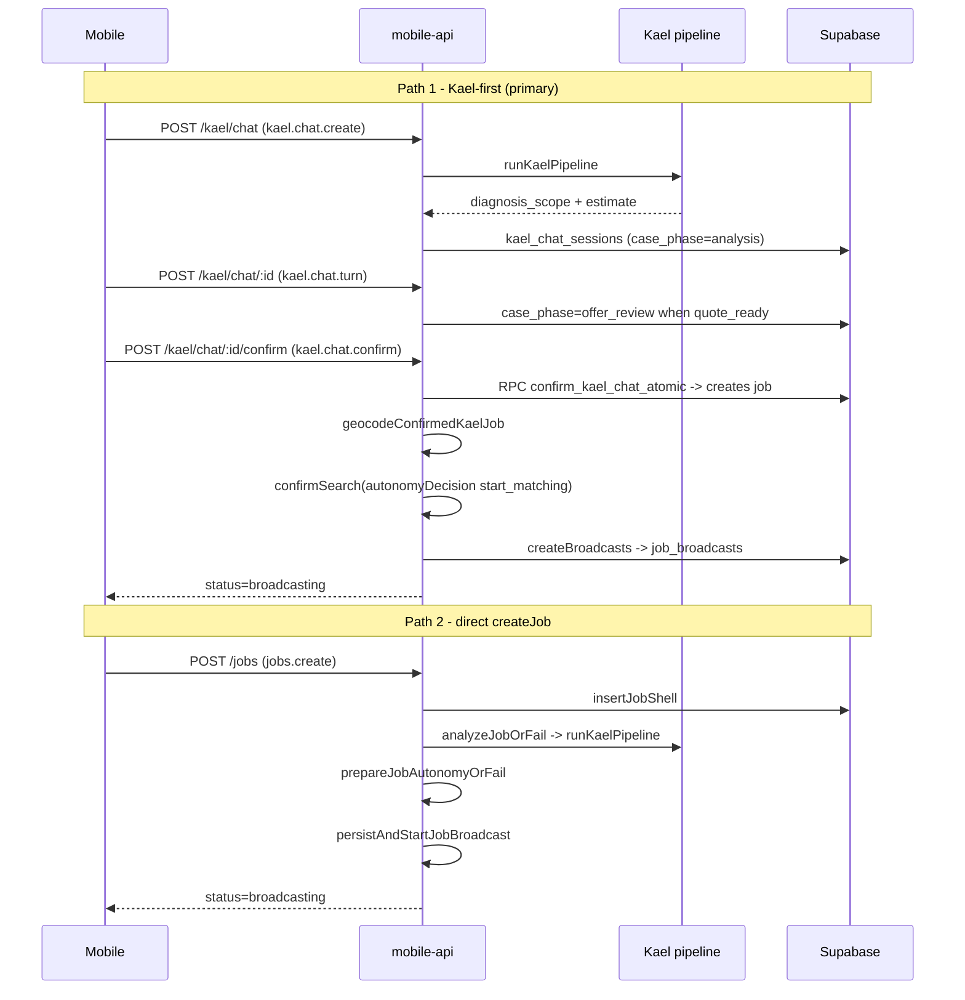

# Structures Spoke - Customer Workflow Part 1 (A0-A7): Intake To Matching Start

> `STRUCTURES.md` §6, first half. Load this spoke for the customer path from auth through the confirmed offer that starts worker search. The second half — **A8–A14**, from the running search to review — is [`customer-workflow-fulfillment.md`](customer-workflow-fulfillment.md).
>
> The seam is deliberate: A7 ends with the job row created and `jobs.status = broadcasting`; A8 opens with the search already running. That is the point where the customer hands the case to the system.
>
> This half also carries §6.0 (how to read a step) and §6.0.1 (the two entry paths) — read them before either half.
>
> `RULES.md` and `critical.md` remain higher authority; if this conflicts with them or with Tu, stop and ask.

## 6. Customer Workflow

Each customer workflow step must be implemented with this shape:

```text
Step contract
-
|- screen purpose
|- user input
|- backend dependency
|- state transition
|- validation
|- error states
|- events emitted
|- tests needed
```

### Customer Workflow Illustration

```text
Customer opens app
-
|- chooses role first
|- signs in with current Supabase email/password auth in Phase 0
|- phone OTP is a later production-auth upgrade after SMS provider setup
|- creates apartment profile
|- selects one of the six supported services
|- submits Basic Intake: location + desired time + short description + optional chips/media
|- Kael analyzes with the selected service profile
|- Kael asks one focused question per turn until quote-ready
|- Kael shows a structured diagnosis/scope and evidence-backed price estimate
|- customer explicitly confirms the offer
|- Kael validates the matching decision and starts worker search
|- worker accepts as a candidate
|- customer explicitly confirms the proposed worker
|- customer tracks job + chats
|- worker reports scope change if needed
|- Kael explains a scope change; customer explicitly confirms before changed work continues
|- worker completes
|- customer explicitly confirms completion or opens a dispute
|- customer explicitly pays through an implemented rail
|- review
```

### 6.0 How to read a step

Every step below has two blocks and they answer different questions:

- **Contract** (the original `text` fence) — what this step *must guarantee*. Product law. Not derivable from code; changing it is a product decision.
- **Runtime** — what the code *actually does today*, anchored on function names so a moved file does not rot the doc. Descriptive. If it disagrees with the code, the code is right and this block is stale.

Runtime blocks use a fixed shape:

```text
Trigger   route kind + the mobile caller
Chain     fn -> fn -> fn (real call order)
Writes    tables/columns written, RPCs called
Emits     logJobEvent name, notification eventType
Gates     validation / autonomy decision / role guard that can stop it
Fails as  ApiFailure code + HTTP status per branch
```

Paths are relative to `supabase/functions/mobile-api/_shared/`. Every route passes through the common request lifecycle first (§22): CORS → `matchRoute` → `authenticate(request, route.roles)` → `enforceKaelRuntimePathControl` → `dispatchRoute`.

### 6.0.1 Two entry paths, one spine

There are **two** ways a job comes into existence, and they are not variants of one function:



Path 1 is the primary product flow: the customer talks to Kael, and the job row is created **at confirm time** by the `confirm_kael_chat_atomic` RPC. Path 2 creates the job row first and runs the pipeline inside the request. Both converge on `confirmSearch → createBroadcasts` and both end at `broadcasting`.

### A0. Auth And Profile

```text
Purpose
-
|- authenticate customer
|- create minimum usable apartment profile

User input
-
|- email
|- password
|- phone number later when OTP auth is enabled
|- name
|- building name
|- unit number
|- floor
|- district

Backend dependency
-
|- auth profile
|- customer profile
|- role = customer

Validation
-
|- email required in Phase 0
|- password required in Phase 0
|- phone/OTP required later when SMS provider is enabled
|- district required
|- address can be edited later

Events
-
|- customer_profile_created

Tests
-
|- role cannot be escalated by client metadata
|- customer profile is created with required fields
```

**Runtime**

```text
Trigger   no mobile-api route - auth is the one flow that talks to Supabase directly
Chain     apps/mobile/lib/auth-provider.tsx -> supabase.auth (password / OAuth)
          -> profile bootstrap reads profiles.role -> Expo Router group gate
          ((customer) / (worker) / (admin) _layout.tsx)
Writes    auth.users + profiles (role assigned server-side by trigger, never by client)
Gates     every later mobile-api call carries the access token; platform/auth.ts
          authenticate() re-checks the role against route.roles on each request
Fails as  AUTH_MISSING 401 (no/invalid token) - AUTH_FORBIDDEN 403 (role not in route.roles)
```

Role is never trusted from the client. `route.roles` on the matched route is the authority, checked per request in the Edge handler.

### A1. Customer Home

```text
Purpose
-
|- show active address
|- provide entry to all six supported service routes
|- show active booking if any
|- show recent jobs

UI
-
|- greeting
|- notification bell
|- profile entry
|- address bar
|- electrical card
|- plumbing card
|- cleaning card
|- HVAC and indoor air card
|- upholstery care card
|- minor repair/installation card
|- no additional future-service cards unless Tu explicitly approves them for the current task
|- active booking banner
|- recent history
|- bottom tabs: Home / Book / Kael / History / Profile

Rules
-
|- only the six supported services appear as selectable real services
|- user-facing text must be Vietnamese
```

**Runtime**

```text
Trigger   app/(customer)/home.tsx -> CustomerHomeSurface
Chain     jobService.getServices          -> GET /services         (services)
          jobService.listMyActiveJob      -> GET /me/jobs/active   (me.jobs.active)
          jobService.listMyServiceHistory -> GET /me/jobs/history  (me.jobs.history)
Writes    none - read/bootstrap only, no workflow write from home
Gates     role guard customer
Fails as  standard envelope; surfaces must render an empty state, never a fabricated job
```

The dock is 4 tabs + the Kael accessory, not the 5 flat tabs the Contract block above still names — see `build-contracts.md` §18 for the real navigation model.

### A2. Select Service And Start Basic Intake

```text
Purpose
-
|- capture the service and a lightweight starting signal without diagnosing on the route

User input
-
|- service_type: electrical, plumbing, cleaning, hvac, upholstery, or handyman
|- optional problem/detail chips
|- optional short free text

Backend dependency
-
|- six-service taxonomy
|- service-to-performance-profile mapping

Validation
-
|- service_type must be one of the six supported identifiers
|- chips must not become required static questionnaire fields
|- unsupported service returns polite decline

Events
-
|- basic_intake_started
```

**Runtime**

```text
Trigger   app/(customer)/booking.tsx -> CustomerBookingEntrySurface
Chain     components/customer/booking/use-booking-form-state.ts (fields)
          + use-booking-address-lookup.ts -> placesService.autocomplete
            -> POST /places/autocomplete (places.autocomplete)
Writes    nothing server-side yet - A2 is entirely local state
Gates     service_type must be one of the six (shared constants); the surface renders
          only supported services, so an unsupported tap is unreachable
```

**No job row and no Kael session exist yet at A2.** Everything up to A3 is local: the intake becomes a `PendingKaelChatDraft` (`apps/mobile/lib/pending-kael-chat-draft.ts`) that the Kael chat route consumes.

### A3. Submit Basic Intake

```text
Purpose
-
|- collect the minimum context needed to hand the case to Kael

User input
-
|- required location
|- desired date/time or honest flexible-time state
|- short description
|- optional photos
|- optional editable on-device voice transcript
|- optional 1-3 locally extracted video frames
|- optional original video stored privately for human review only, after explicit disclosure

Backend dependency
-
|- draft job
|- private evidence upload
|- Kael analysis request

Validation
-
|- location, desired-time intent, and short description must be usable
|- media type/size validation
|- sanitize input before DB/LLM
|- raw audio must not leave the device; raw video must never be sent to an AI provider
|- voice transcript remains editable before submit and is scrubbed for PII
|- locally extracted video frames are validated and scrubbed before vision analysis

Events
-
|- job_draft_created
|- kael_analysis_started
```

**Runtime**

```text
Trigger   kael.chat.create - POST /kael/chat - kaelChatService.create
Chain     createKaelChat (domains/kael-chat/create.ts)
          -> persistence.service.ts inserts kael_chat_sessions (case_phase='analysis')
          -> intake.ts + intake-safety.ts normalize and screen the Basic Intake
          -> runKaelPipeline (see kael-workflow.md section 9)
          -> branches-post-pipeline.ts -> case-work-artifact.ts writes diagnosis_scope
Writes    kael_chat_sessions (case_phase, diagnosis_scope, scheduled_at, total_turns,
          total_cost_usd, safe_metadata); kael_chat_messages
Media     media-upload.ts -> POST /kael/chat/media-upload (kael.chat.mediaUpload) returns a
          signed intent; media-vision.ts feeds only validated frames to vision.
          Raw audio never leaves the device; raw video is never sent to a provider (RULES.md)
Gates     checkRateLimit AI_SESSION_LIMIT - intake-safety screening - boundary guard
Fails as  RATE_LIMITED 429 - VALIDATION 400 - the pipeline's own failure states
```

A job row is still **not** created here. The session is the only durable artifact until A7.

### A4. Kael Clarification

```text
Purpose
-
|- ask only what is needed to make the diagnosis/scope artifact quote-ready

Behavior
-
|- ask exactly one focused question per turn when information is missing
|- continue across as many turns as needed; there is no fixed two-question cap
|- never ask generic "please provide more info"
|- skip if context is already enough
|- stay in the analysis phase until quote readiness is validated
|- accept new text, photos, editable voice transcript, or locally extracted video frames during analysis

Examples
-
|- "Is the issue affecting one drain or multiple drains?"
|- "Does the breaker trip again after you turn it back on?"

Events
-
|- kael_clarification_requested
|- kael_clarification_answered
```

**Runtime**

```text
Trigger   kael.chat.turn - POST /kael/chat/:id - kaelChatService.sendTurn
Chain     sendKaelChatTurn (domains/kael-chat/turn.ts)
          -> guard.ts (session ownership + phase) -> branches-pre-pipeline.ts
          -> clarification.service.ts decides ask-one-question vs proceed
          -> runKaelPipeline when new evidence changes the case
          -> advance.ts + case-work-artifact.ts rewrite diagnosis_scope
Streaming kael.chat.stream / kael.chat.progress feed emit-step.ts + stream.ts;
          mobile reads them through lib/kael-stream.ts + kael-response-stream.ts
Writes    kael_chat_sessions.diagnosis_scope, total_turns; kael_chat_messages
Gates     one focused question per turn is a pipeline/prompt contract, not a DB constraint
Fails as  NOT_FOUND 404 (session) - INVALID_STATUS 409 - RATE_LIMITED 429
```

### A5. Price Estimate Card

```text
Purpose
-
|- show the structured diagnosis/scope and transparent estimated market price before matching

Content
-
|- identified problem
|- included/excluded scope
|- evidence and unresolved assumptions
|- safety/capability requirements when relevant
|- complexity: small / medium / large
|- price range only when supported by real baseline/market evidence
|- confidence if useful
|- one optional advisory only when justified
|- required price disclaimer

Required disclaimer meaning
-
|- this is a market estimate
|- final price is computed by Kael from validated evidence before work starts

Rules
-
|- never show exact guaranteed price
|- never show raw AI output
|- always validate structured Kael output first
|- if quote readiness or price evidence is missing, show an honest not-ready state and continue clarification
```

**Runtime**

```text
Trigger   no route of its own - the card renders from the kael.chat.turn / kael.chat.get payload
Chain     estimate-support.ts builds the estimate and sets
          case_phase = quoteReady ? 'offer_review' : 'analysis'
          -> estimate-copy.ts owns the Vietnamese copy incl. the mandatory disclaimer
          -> serialize.ts projects the session for mobile
UI owner  components/customer/kael-chat/agentic-chat-estimate-response.tsx
          + agentic-estimate-display-model.ts
Writes    kael_chat_sessions.case_phase, diagnosis_scope, estimate_ready_at
Gates     quote_ready true AND quote_blockers empty AND facts.needs_inspection not true
          AND next_action.kind = 'prepare_offer' - all four are re-checked at A7
Fails as  not an error path - a case that is not quote-ready stays in 'analysis' and
          Kael keeps clarifying; the surface shows an honest not-ready state
```

`case_phase = offer_review` is the single machine-readable signal that the offer may be shown. It is also the gate A7 reads, so the card and the confirm button cannot disagree.

### A6. Desired Time (Basic Intake Field)

```text
Purpose
-
|- capture the customer's real desired time without turning the route into a multi-step questionnaire

Options
-
|- now
|- scheduled date/time slot
|- flexible time when supported by the backend contract

Validation
-
|- unavailable time slots cannot be selected
|- do not render fake/disabled schedule slots in the current primary transaction path
|- default is now during early phase
```

**Runtime**

```text
Stored as kael_chat_sessions.scheduled_at (Kael-first path) or jobs.scheduled_at (direct path)
Validated platform/scheduling.ts validateFutureHcmcSchedule - Asia/Ho_Chi_Minh, must be future
Checked   at A7 confirm (only when the session has no job yet) and on every createJob
Fails as  VALIDATION 400 with HCMC_SCHEDULE_VALIDATION_MESSAGE
Note      createJob skips the schedule check on the first pass when client_request_id is
          present, then re-checks after the idempotency lookup misses - so a retry of an
          already-created job never fails on a now-past schedule
```

### A7. Customer Confirms Offer; Kael Starts Worker Search

```text
Purpose
-
|- collect explicit customer confirmation of the offer, then validate the server decision before broadcasting

Summary shown
-
|- service
|- problem
|- address
|- time
|- estimated price range
|- platform fee
|- cancellation note if applicable

Hard rule
-
|- no matching before the customer confirms the current offer
|- no job broadcast from raw AI output or client-side status writes
|- broadcast requires `KaelAutonomyDecision(actor=kael_system, action=start_matching)`

Events
-
|- customer_offer_confirmed
|- kael_started_matching
|- job_ready_for_broadcast
```

**Runtime — path 1, Kael-first (primary)**

```text
Trigger   kael.chat.confirm - POST /kael/chat/:id/confirm - kaelChatService.confirm
Chain     confirmKaelChat (domains/kael-chat/confirm.service.ts)
          -> re-validates case_phase in {offer_review, matching} + kaelDiagnosisScopeArtifactSchema
             + quote_ready + no quote_blockers + needs_inspection not true
             + next_action.kind = 'prepare_offer'
          -> RPC confirm_kael_chat_atomic (creates the jobs row, sets case_phase='matching')
          -> geocodeConfirmedKaelJob (domains/places/geo.ts)
          -> confirmSearch(ctx, jobId, { kaelSessionId, autonomyDecision })
          -> prepareSearchBroadcast -> executeSearchBroadcast -> createBroadcasts
Decision  buildKaelAutonomyDecision({ action: 'start_matching',
          policyId: 'kael.autonomy.v2.chat_estimate_to_matching',
          evidence: [session artifact, job artifact, RULES.md#rule-7], reversible, appealable })
Writes    jobs.status='broadcasting', broadcast_at, confirmed_search_at, final_price,
          kael_worker_brief_core (buildWorkerBriefOutput stage 'core'); job_broadcasts rows
Emits     logJobEvent 'kael_started_matching' then 'broadcast_sent'
Gates     validateKaelAutonomyTransition - the update is a compare-and-set on
          (id, customer_id, status) so a concurrent change loses safely
Fails as  NOT_FOUND 404 (session) - INVALID_STATUS 409 (scope not quote-ready)
          KAEL_PRICE_MISSING 409 (no locked price) - BROADCAST_ACTIVE 409
          STATUS_CHANGED 409 (lost the compare-and-set) - DB_ERROR 500
Recovery  ALREADY_CONFIRMED returns the current job state instead of an error; if the job
          is still awaiting_customer_confirm the retry completes one idempotent matching
          transition and must not create a second broadcast
Rollback  a DB_ERROR from createBroadcasts triggers rollbackFailedBroadcastStart +
          restoreKaelOfferAfterBroadcastFailure, then logs 'broadcast_start_failed'
```

**Runtime — path 2, direct `createJob`**

```text
Trigger   jobs.create - POST /jobs - jobService.createJob
Chain     createJob (domains/job/create/create.ts)
          -> validateFutureHcmcSchedule + normalizeServiceAreaDistrict
          -> findExistingJobByClientRequest (client_request_id idempotency)
          -> checkRateLimit AI_SESSION_LIMIT
          -> insertJobShell -> analyzeJobOrFail (runKaelPipeline)
          -> prepareJobAutonomyOrFail -> persistAndStartJobBroadcast
Emits     logJobEvent 'kael_started_matching' (analyzing -> broadcasting)
          + notification 'estimate_ready' ("Kael đang điều phối")
Returns   job_id, status='broadcasting', estimate, estimate_card_v3, final_price,
          fallback_used, broadcast_sent
Fails as  VALIDATION 400 (schedule/district) - RATE_LIMITED 429 - DB_ERROR 500
```

Both paths end at `broadcasting` and both require a validated `KaelAutonomyDecision`. Neither can be reached from raw AI output or a client-side status write.

---

**A8–A14 continue in [`customer-workflow-fulfillment.md`](customer-workflow-fulfillment.md)** — searching, candidate confirmation, active job, scope change, completion, payment, review.

Per-step owner files (routes, surfaces, providers, tests) live in [`docs/architecture/code-ownership-map.md`](../../docs/architecture/code-ownership-map.md). This spoke owns the workflow contract and the runtime call order; that map owns which file to open.

