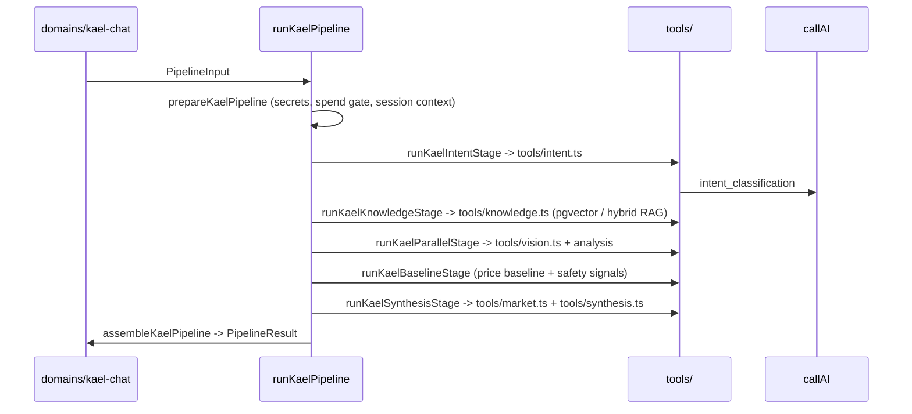

# Structures Spoke - Kael Workflow

> Extracted from `STRUCTURES.md` section 9 for progressive disclosure (2026-06-24). The hub keeps sections 0-4 plus the spoke routing table; load this spoke for Kael artifacts, price-check flow, provider roles, structured output. `RULES.md` and `critical.md` remain higher authority; if this conflicts with them or with Tu, stop and ask.

## 9. Kael Workflow

Kael is the default server-side workflow actor for money-impacting orchestration when policy has enough evidence. Raw LLM output remains non-authoritative: every transition requires a validated `KaelAutonomyDecision` with policy id, evidence, confidence, reversibility/appealability, and resulting event.

### Kael Artifact Lifecycle

```text
Canonical artifacts
-
|- service_request
|- process_ticket
|- diagnosis_scope
|- ai_diagnosis
|- ai_notes
|- estimate
|- worker_brief
|- worker_candidate
|- provider_match
|- booking
|- scope_change
|- cancellation_review
|- completion_evidence
|- completion_review
|- dispute_decision
|- payment_decision
|- review
```

These artifacts are created or updated by Kael, workers, clients, or admin according to the workflow phase. They are audit records and phase-gated UI inputs, not direct status writers. Any artifact that implies money, booking, cancellation, scope, completion, dispute, or payment movement still requires the actor-specific validated server transition: a `KaelAutonomyDecision` only for eligible non-confirmation automation, an explicit authenticated customer action at a required gate, or an explicit admin override.

### Kael Case Work Analysis And Offer Flow

```text
Kael Case Work flow
-
|- classify intent
|- reject out-of-scope service
|- select exactly one of the six service performance profiles
|- understand the case from text, private photos, editable on-device voice transcript, and 1-3 locally extracted video frames
|- never send raw audio or raw video to an AI provider
|- build/update the structured diagnosis/scope artifact
|- ask exactly one focused question per turn until quote-ready; no fixed question cap
|- run price search only when the case is quote-ready and a validated source path exists
|- compare search result with baseline
|- synthesize a structured price estimate or an honest not-ready state
|- generate at most one advisory
|- stop for explicit customer offer confirmation
|- create worker pre-brief after the validated matching decision
|- search eligible workers; treat worker acceptance as a candidate proposal
|- stop for explicit customer candidate confirmation before final assignment
|- stop again at scope-change, completion, and payment confirmation phases
```

### AI Provider Roles

```text
DeepSeek
-
|- primary text default for intent_classification, clarification, problem_synthesis, advisory_generation, worker_brief, post_job_learning, educational_response
|- Anthropic fallback when `ai_provider_routing` / `routing.config.ts` allows it

Anthropic
-
|- required vision_analysis with no fallback
|- scope_change reasoning
|- price_synthesis primary after F26 A/B rejected Perplexity for purpose #6

Perplexity
-
|- market_lookup
|- restricted to Tier 1 Vietnamese sources when source-trust filtering is enabled

Provider role mapping is sourced from `ai_provider_routing` (DB) plus `routing.config.ts` (code). Effective 2026-05-26 per Plan.md §23 P3 and §25 R2; Tu approval is recorded in Plan.md §26 F1.
```

### Structured Kael Output

```text
Kael output shape
-
|- service_type
|- performance_profile
|- problem_category
|- problem_summary
|- facts
|- missing_facts
|- evidence_summary
|- included_scope
|- excluded_scope
|- safety_flags
|- required_worker_capabilities
|- quote_ready
|- complexity
|- price_min_optional
|- price_max_optional
|- confidence
|- next_focused_question_optional
|- next_action
|- advisory_optional
|- disclaimer
|- worker_prebrief
```

Rules:

```text
Kael output rules
-
|- structured data first
|- prose second
|- schema validation before UI
|- no raw AI output to user
|- no exact price guarantee
|- no unsupported service advice
|- no invented baseline, worker, ETA, or payment state
|- HVAC may cover cleaning, diagnosis, or repair when evidence and worker capabilities support it
|- service-specific behavior comes from the selected server profile, not a long client-side questionnaire
|- one advisory max
|- no fear-based upsell language
```

---

## 9.5 Runtime — how a Kael request actually executes

Descriptive, not contractual: this is what the code does today. Paths are relative to `supabase/functions/mobile-api/_shared/kael/`. If this disagrees with the code, the code is right.

### 9.5.1 The pipeline has seven stages

`pipeline/pipeline.ts` → `runKaelPipeline(input, supabase, secrets)`:



| Stage | Function | Owns |
|---|---|---|
| 1 | `prepareKaelPipeline` | secrets, spend gate, session context; can short-circuit with a failure result before any provider call |
| 2 | `runKaelIntentStage` | intent, service validation, problem slug, safety signals, profile facts, intake observation |
| 3 | `runKaelKnowledgeStage` | RAG retrieval for the resolved service + problem (`tools/knowledge.ts`) |
| 4 | `runKaelParallelStage` | vision analysis + problem analysis concurrently; returns `visionAnalysisStatus` and effective complexity |
| 5 | `runKaelBaselineStage` | price baseline + reference baseline; **can fail the whole pipeline** (`baselineStage.ok === false`) |
| 6 | `runKaelSynthesisStage` | market lookup, market verdict, synthesized estimate |
| 7 | `assembleKaelPipeline` | the final `PipelineResult` the domain layer persists |

`fallbackUsed` is threaded through stages 2, 4 and 6 and surfaces on the result — that is how a degraded answer stays labelled instead of silently passing as a normal one (RULES.md #8).

**§1.5 names four stages (intent → knowledge → baseline → synthesis).** That is the shorthand for the pricing spine; the real chain is the seven above.

### 9.5.2 Guardrails, and where each one sits

`kael-guardrails/` holds 16 modules. They are not one filter — they run at different points, and knowing which is which decides where a fix belongs.

| When | Module | Entry point |
|---|---|---|
| before any provider call | `pipeline-spend-gate.ts` | `prepareKaelPipelineSpendGate` |
| before any provider call | `spend-gate.ts` | `reserveAiSpend`, `isKaelAiKillSwitchEnabled`, `KAEL_AI_SPEND_CAPS` |
| before any provider call | `rate-limit.ts` / `durable-guards.ts` | `checkKaelActorRateLimit`, `takeDurableKaelChatRateLimit` |
| on inbound message | `boundary-guard.ts` | `detectPromptInjection`, `detectOutOfScope`, `detectServiceMismatch`, `evaluateMessageBoundary` |
| on inbound message | `permission-gate.ts` | `evaluateKaelPermissionGate`, `renderDeclineTemplate` |
| per route | `path-control.ts` | `evaluateKaelPathControl` (wired at the handler as `enforceKaelRuntimePathControl`) |
| during case work | `case-work-controls.ts` | `resolveCaseWorkEvidenceRequest`, `buildProfileSafetyFlags` |
| during case work | `electrical-intake-policy.ts` | `getRequiredSlotPolicy`, `applyHardRoutingPolicy` |
| on scope change | `scope-risk.ts` | `calculateScopeChangeAnomaly`, `matchSuspiciousScopeKeywords` |
| on outbound text | `self-check.ts` | `runKaelSelfCheckPipeline`, `checkKaelResponse`, `auditKaelGuardrailTrip` |
| on outbound text | `output-gateway.ts` | `guardOutput` |
| on outbound artifact | `output-pipeline.ts` | `runKaelOutputPipeline`, `buildEstimateCardOutput`, `buildWorkerBriefOutput`, `buildScopeChangeOutputs` |
| on a workflow decision | `autonomy-gate.ts` | `gateAutonomyDecision`, `auditKaelAutonomyGateResult`, `replayAutonomyDecisionAudit` |
| on failure | `escalation.ts` | `selectKaelEscalation`, `logKaelEscalation` |
| cost ceiling | `cost-cap.ts` | `KAEL_CHAT_HARD_COST_CAP_USD` |

Guardrails fail **closed**: a trip produces a safe Vietnamese template (`KAEL_AI_UNAVAILABLE_VI`, `renderDeclineTemplate`) and an audit row, never a blank success.

### 9.5.3 Provider call path

Every AI call goes through `kael-providers/provider-client.ts` → `callAI(request, secrets, gate)`; the structured variant is `callStructuredAI`. There is no other legal path (RULES.md #2).

```text
purpose -> chooseProvider / providerCandidatesForPurpose        (KAEL_ROUTING_CONFIG)
        -> chooseCircuitAwareProvider                            (skips an open breaker)
        -> providerAdapterFor(provider) -> HTTP with timeout
        -> failureKindForCode -> recordDurableCircuitFailure/Success
        -> recordKaelProviderSpend + checkKaelProviderBudget
```

- The model ladder per purpose lives in `agents/agentic-harness.ts`; **do not hardcode a model id at a call site**.
- `createKaelCircuitBreaker` / `KAEL_CIRCUIT_BREAKER` own breaker state; `isDurableCircuitOpen` makes it survive a cold start.
- Batching: `createAnthropicMessageBatch`, `retrieveAnthropicMessageBatch`, `retrieveAnthropicBatchResults`.
- `maxTokensForPurpose` and `isSimpleNormalChatMessage` are the cost controls that keep a trivial chat turn off the expensive ladder.

### 9.5.4 Streaming

`pipeline/streaming.ts` writes progress targets; `domains/kael-chat/emit-step.ts` and `stream.ts` publish them. Mobile consumes through `apps/mobile/lib/kael-stream.ts`, `kael-response-stream.ts`, and `kael-stream-validation.ts`. Streaming carries **progress**, never authority: no workflow state is written from a stream frame.

### 9.5.5 The autonomy cycle

```text
build     buildKaelAutonomyDecision(...)              -> KaelAutonomyDecision object
gate      gateAutonomyDecision                        -> guardrail-level check + audit
validate  validateKaelAutonomyTransition(decision,    -> schema + action/event match
          from, to)                                      + lifecycle pair check
apply     the domain writes the status inside a
          compare-and-set on the previous status
audit     auditKaelAutonomyGateResult /
          replayAutonomyDecisionAudit
```

All four steps are required. A decision that passes the schema but names an event its action does not permit is rejected — see `state-machines.md` §12.5.
