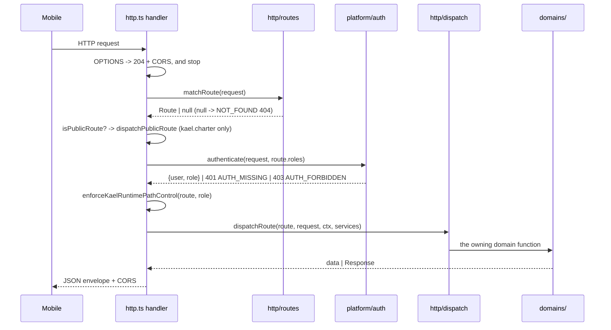

# Structures Spoke - Runtime Cross-Cutting Concerns

> `STRUCTURES.md` §22. Load this spoke for the mechanics every request shares: the request lifecycle, auth and role gating, realtime, notifications and push, media and storage, rate limiting, idempotency, and the error envelope. `RULES.md` and `critical.md` remain higher authority; if this conflicts with them or with Tu, stop and ask.
>
> This spoke is **descriptive**: it records what the code does today, anchored on function names. Where it disagrees with the code, the code is right. Product law lives in §6, §7, §9, and §12. Structural invariants live in `STRUCTURES.md` §4.5. File-level ownership lives in `docs/architecture/code-ownership-map.md`.

Paths are relative to `supabase/functions/mobile-api/_shared/`.

## 22. Cross-Cutting Runtime

### 22.1 The request lifecycle

Every authenticated call to `mobile-api` runs the same seven steps, in `http.ts` → `createMobileApiHandler`:



Details that matter:

- **Route order is the contract.** `routes/index.ts` calls the matchers in a fixed sequence and several claim overlapping prefixes (`/jobs/:id/...` is shared by the case-work matcher and the job resource matcher). Reordering the calls changes which route a path resolves to without changing any path string.
- **`matchRoute` normalizes the prefix** — both `/functions/v1/mobile-api/...` and `/mobile-api/...` are stripped, and a trailing slash is removed, so the same handler serves the direct and the gateway form.
- **Exactly one public route exists:** `kael.charter` (`GET /kael/charter`). Everything else requires a token.
- **`route.roles` is the authority.** The client never asserts a role; `createEdgeAuthenticator` re-checks it per request.
- **`enforceKaelRuntimePathControl`** runs after auth and before dispatch, applying `kael-guardrails/path-control.ts` so a role cannot reach a Kael path it has no business on.
- **`successStatus`** on a route overrides the default 200 (for example a 201 on create).
- A domain may return a raw `Response` (streaming); the handler re-applies CORS through `withCorsHeaders` instead of re-wrapping the body.

### 22.2 Errors and the response envelope

Success is the domain's payload serialized as JSON. Failure is always the same shape:

```json
{ "code": "INVALID_STATUS", "error": "Trạng thái đã thay đổi...", "...extra": "optional" }
```

- `apiFailure(code, message, status, extra?)` throws an `ApiFailure`; the handler converts it. Anything else that escapes becomes `INTERNAL_ERROR` 500 with a generic Vietnamese message, and only `errorName` is logged — never the error body, which can contain PII.
- User-facing messages are **Vietnamese** (`RULES.md` #5). Codes are English and stable; mobile branches on the code, never on the message text.
- Domain-specific DB/RPC errors are translated by `platform/domain-error-mappers.ts` (`mapConfirmKaelChatError`, `mapAcceptError`, `mapScopeDecisionError`, …) so an RPC error code becomes a product error rather than leaking a Postgres message.

Codes in use, by frequency — the long tail is meaningful, so check here before inventing a new one:

| Code | Typical HTTP | Meaning |
|---|---|---|
| `DB_ERROR` | 500 | a write or read failed |
| `VALIDATION` | 400 | input rejected before any write |
| `NOT_FOUND` | 404 | resource missing or not visible to this actor |
| `INVALID_STATUS` | 409 | the action is illegal in the current status |
| `AUTH_MISSING` / `AUTH_FORBIDDEN` | 401 / 403 | no token / wrong role |
| `STATUS_CHANGED` | 409 | lost a compare-and-set race; reload and retry |
| `RATE_LIMITED` | 429 | actor limit hit |
| `BROADCAST_ACTIVE` / `BROADCAST_NOT_ACTIVE` | 409 | broadcast lifecycle conflict |
| `ALREADY_DECIDED` / `WORKFLOW_STALE` | 409 | a decision already landed |
| `STORAGE_ERROR` / `STORAGE_NOT_CONFIGURED` / `UNSUPPORTED_MEDIA` / `TOO_MANY_MEDIA` / `INVALID_MEDIA_REF` / `MEDIA_VALIDATION_UNAVAILABLE` | 4xx/5xx | media pipeline |
| `MAP_UNAVAILABLE` / `ROUTE_UNAVAILABLE` | 503 | geo provider down |
| `PAYMENT_PROVIDER_MISMATCH` | 409 | callback did not match the intent |
| `NOT_IMPLEMENTED` | 501 | honest unavailable, never a fake success |

`STATUS_CHANGED` deserves attention: workflow writes are compare-and-set on the previous status (`.eq("status", previous)`), so a concurrent change loses safely instead of double-applying. Mobile treats it as "reload, then decide again", not as an error to retry blindly.

### 22.3 Authentication and role gating

```text
Mobile   apps/mobile/lib/auth-provider.tsx -> supabase.auth (password / OAuth)
         apps/mobile/lib/api.ts attaches the access token to every mobile-api call
Edge     platform/auth.ts createEdgeAuthenticator -> verifies the token, loads the
         profile role, and compares it to route.roles
Row      platform/access.ts requireJobAccess re-checks per-resource ownership
         (customer-owner / assigned-worker / admin) after the role gate passes
DB       RLS remains the last boundary; service-role access lives only in Edge
```

Three independent layers — role, resource ownership, RLS. A bug in one does not silently open the others. Role never comes from the client.

### 22.4 Realtime

`apps/mobile/lib/realtime.ts` subscribes to Postgres changes on RLS-scoped tables:

| Channel | Table | Used by |
|---|---|---|
| `job-messages:<jobId>` | `chat_messages` | both sides of the job chat |
| `job-status:<jobId>` | `jobs` | customer + worker job surfaces |
| `worker-broadcasts:<workerId>` | `job_broadcasts` | worker incoming-request board |

Realtime honors the same access boundary as the REST reads because the target tables are RLS-scoped to the participant. **Polling remains the fallback**: a null/failed subscription must degrade to a poll, never to a blank surface. Realtime carries *notification of change*, not authority — the surface re-reads through `mobile-api` before acting on it.

### 22.5 Notifications and push

```text
Rows     domains/notification/notifications.ts insertUserNotification writes the durable row
Read     listNotifications / markNotificationRead
Tokens   registerDevicePushToken / unregisterDevicePushToken -> device_push_tokens
Push     platform/push.ts sendPushToUser / sendPushToUsers
```

Typed emitters keep the copy consistent and auditable rather than scattering strings across domains: `notifyBroadcastWorkers`, `notifyCustomerWorkerMatched`, `notifyCustomerWorkerCheckedIn`, `notifyCustomerJobStatus`, `notifyCustomerScopeChangeRequested`, `notifyWorkerScopeDecision`, `notifyKaelConfirmedCompletion`, `notifyCustomerWorkerReplacementSearch`, `notifyWorkerCustomerCancellation`, `notifyJobMessageRecipient`.

**Push is best-effort; the notification row is the source of truth.** A failed push must not fail the workflow write that triggered it. Push copy is Vietnamese (`RULES.md` #5).

### 22.6 Media and storage

```text
Intent    domains/job/media.ts createJobMediaUpload returns a signed upload target
Upload    apps/mobile/lib/media-upload.ts uploads directly to private Storage
Attach    domains/job/media-attach.ts attachJobMedia records the ref against the job
Revoke    revokeJobMediaUploads drops an unattached draft
Validate  platform/job-media.ts validateJobMediaPath, canAttachJobMediaStage, storageRef
Stages    before | after | kael_reference | cancellation_evidence |
          scope_change_evidence | access_check_in   (allowed statuses: state-machines.md 12.4)
```

Hard privacy rules carried from `RULES.md`:

- Buckets are **private**. Access is a short-lived signed URL after validation, never a public link.
- **Raw audio never leaves the device.** Voice is transcribed on-device into an editable transcript; the audio is discarded after confirmation.
- **Raw video is never sent to a provider.** Only 1–3 locally extracted, validated frames may reach vision (`kael/tools/vision.ts`, `domains/kael-chat/media-vision.ts`).
- An original video may sit in private storage as human-review evidence only, with disclosure and retention controls — the `kael-media-retention` Edge function owns expiry.
- `canAttachJobMediaStage` is what actually blocks a stage/status mismatch; a UI check is not the boundary.

### 22.7 Rate limiting and spend control

```text
Request  platform/rate-limit.ts  checkRateLimit(key, limit)
         AI_SESSION_LIMIT, KAEL_CHAT_PER_MINUTE_LIMIT, KAEL_CHAT_PER_HOUR_LIMIT
Actor    kael-guardrails/rate-limit.ts    checkKaelActorRateLimit
Durable  kael-guardrails/durable-guards.ts takeDurableKaelChatRateLimit,
         isDurableCircuitOpen, recordDurableCircuitFailure/Success
Spend    kael-guardrails/spend-gate.ts     reserveAiSpend, KAEL_AI_SPEND_CAPS,
                                           isKaelAiKillSwitchEnabled
Cost cap kael-guardrails/cost-cap.ts       KAEL_CHAT_HARD_COST_CAP_USD
```

The in-memory limiter dies with the isolate, which is why the durable variants exist for anything that must survive a cold start. Every AI route is limited (`RULES.md` input-validation section); an unbounded provider route is a defect, not a feature.

### 22.8 Idempotency

`client_request_id` is the customer-supplied dedupe key on job creation:

```text
1. findExistingJobByClientRequest(client, userId, clientRequestId)
   -> hit: return buildExistingJobCreateResponse, no new work, no second Kael spend
2. miss: re-run the schedule validation that was skipped on the first pass,
   then insertJobShell
3. insertJobShell reports kind='duplicate_client_request' on a unique-constraint race
   -> re-run the lookup and return the recovered job
```

The schedule check is deliberately deferred past the idempotency lookup: a retry of an already-created job must not fail because its scheduled time has since passed.

The same principle covers the other replayable paths — `confirm_kael_chat_atomic` returns `ALREADY_CONFIRMED` with the current state rather than an error, and worker accept is an atomic claim so two workers racing one broadcast produce exactly one candidate.

Idempotency is required for: auth/profile creation, the Kael matching decision, job broadcast, worker accept, scope-change decision, the Kael completion decision, payment callbacks, and learning-rule promotion (§19).

### 22.9 Audit trail

```text
logJobEvent(client, jobId, event, ctx, from, to, metadata?)   platform/audit.ts
logMemoryAudit(...)                                            Kael memory reads/writes
auditKaelGuardrailTrip(...)                                    kael-guardrails/self-check.ts
auditKaelAutonomyGateResult / replayAutonomyDecisionAudit      kael-guardrails/autonomy-gate.ts
```

Every workflow transition writes a job event with its `from`/`to` status and safe metadata — including the full `autonomy_decision` when Kael drove it. Non-transition outcomes are logged too (`no_worker_found`, `broadcast_start_failed`, `customer_retried_search`), so an operational silence is itself a defect. Metadata is safe fields only: ids, codes, counts, coarse district (`RULES.md` #9).

### 22.10 Streaming (SSE)

`platform/sse.ts` provides `createSseResponse`, `encodeSseEvent`, and `encodeSseHeartbeat`. Kael progress routes (`kael.chat.stream`, `kael.chat.progress`, `customer.kaelConversations.stream`, `workers.kaelChat.stream`) return a raw `Response`; the handler re-applies CORS rather than re-wrapping it. Heartbeats keep the connection alive through idle analysis. **A stream frame carries progress, never authority** — no workflow state is written from one.

### 22.11 The learning loop

Learning is queued, never inline:

```text
completion / review  -> queueKaelLearningEvent (audit path, fire-and-forget)
                     -> kael_learning_* tables
                     -> the kael-learning-monitor Edge function drains and evaluates
                     -> evidence gate (kael/learning/**) decides promotion
                     -> admin review via the 8 admin.* route kinds
```

A learning write must never execute inside a customer or worker workflow request — a slow or failing learning path cannot be allowed to break a booking. Forbidden effects, evidence gates, and rollback are in [`kael-learning.md`](kael-learning.md) §10.

### 22.12 Environment and secrets

`platform/edge-env.ts` reads server-side configuration (`readGoogleMapsApiKey`, `readVietmapApiKey`, `readEdgeEnvNumber`). Provider keys, service-role keys, and payment secrets exist only in the Edge runtime. The mobile bundle carries the Supabase URL and publishable key and nothing with server authority (`RULES.md` #1). `config/env/workspace.env.example` is the authoritative key-name inventory — names only, never values.
