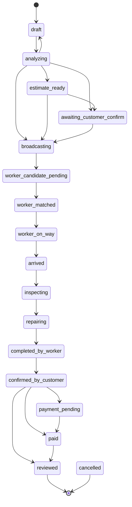

# Structures Spoke - State Machines And Workflow Events

> Extracted from `STRUCTURES.md` section 12 for progressive disclosure. The hub keeps sections 0-4 plus the spoke routing table; load this spoke for every shared state machine, the workflow event vocabulary, and the status cross-walk. `RULES.md` and `critical.md` remain higher authority; if this conflicts with them or with Tu, stop and ask.
>
> This spoke absorbed `docs/architecture/status-vocabulary.md`, which is now a redirect stub. Two errors were corrected in the move: that file listed 17 job statuses (it was missing `worker_candidate_pending`) and located `LocalDealStatus` at `packages/shared/src/mobile-workflow.ts`, which is now a one-line facade over `mobile-workflow/**`.

## 12. State Machines

Frontend and backend must share these state machines. UI states must not invent transitions that backend does not support.

Everything in §12.1–§12.6 is generated from source, and every table says which file owns it. When code and this doc disagree, **the code wins and this doc is wrong** — fix it here rather than working around it.

### 12.1 Three vocabularies, one job

A job is described by three different vocabularies at once. Confusing them is the most common source of "the UI shows the wrong stage" bugs.

| Layer | Values | Owner | Purpose |
|---|---|---|---|
| `jobs.status` | **18** | DB enum + `platform/lifecycle.ts` | the persisted truth; the only thing a transition may write |
| `WorkflowPhase` | **19** | `packages/shared/src/workflow/workflow-phases.ts` | the mobile-facing projection that drives phase-gated reveal |
| `kael_chat_sessions.case_phase` | **11 declared / 3 reachable** | migration `20260711033644` + `kael/contracts/artifact-contract.ts` | how far the Kael Case Work conversation may reveal itself |

`WorkflowPhase` has one more value than `jobs.status` because `WORKFLOW_PHASES` includes `kael_collecting`, which no status maps to — it is a conversation-level phase with no persisted job counterpart.

Cross-walk, from `JOB_STATUS_TO_WORKFLOW_PHASE`:

| `jobs.status` | `WorkflowPhase` | Note |
|---|---|---|
| `draft` | `intake_started` | |
| `analyzing` | `kael_estimating` | |
| `estimate_ready` | `kael_explaining` | |
| `awaiting_customer_confirm` | `ticket_review` | legacy compatibility state; label it as Kael orchestration, not a customer gate |
| `broadcasting` | `matching` | |
| `worker_candidate_pending` | `worker_candidate_review` | **the status `status-vocabulary.md` was missing** |
| `worker_matched` | `worker_matched` | |
| `worker_on_way` | `worker_on_way` | |
| `arrived` | `arrived` | |
| `inspecting` | `inspecting` | |
| `repairing` | `repairing` | |
| `scope_change_pending` | `scope_change_pending` | |
| `completed_by_worker` | `completed_by_worker` | |
| `confirmed_by_customer` | `customer_confirmed_completion` | |
| `payment_pending` | `payment_pending` | |
| `paid` | `paid` | |
| `reviewed` | `done` | do not introduce a user-visible `reviewed` phase |
| `cancelled` | `cancelled` | |
| — | `kael_collecting` | no status maps here |

`toWorkflowPhase()` throws `RangeError` on an unknown status, so a new DB enum value that skips this map fails loudly rather than rendering a blank screen.

Regenerate: `grep -c "'" packages/shared/src/workflow/workflow-phases.ts` is not a count — read `WORKFLOW_PHASES` and `JOB_STATUS_TO_WORKFLOW_PHASE` directly; the `satisfies Record<JobStatus, WorkflowPhase>` clause is what keeps them exhaustive.

### 12.2 Job lifecycle

Owner: `VALID_TRANSITIONS` in `supabase/functions/mobile-api/_shared/platform/lifecycle.ts`. `validateTransition(from, to)` is the only gate, and it also returns the timestamp column to stamp.



Two edge families are omitted from the diagram to keep it readable; they are normative and listed here instead:

- **Re-match** — `worker_candidate_pending`, `worker_matched`, `worker_on_way`, `arrived`, `inspecting`, `repairing`, and `scope_change_pending` may all return to `broadcasting`.
- **Cancel** — every status except `completed_by_worker`, `confirmed_by_customer`, `payment_pending`, `paid`, `reviewed`, and `cancelled` may go to `cancelled`.
- **Scope change** — `worker_matched`, `worker_on_way`, `arrived`, `inspecting`, and `repairing` may enter `scope_change_pending`, which returns to any one of those five.

Timestamp columns stamped on entry (`STATUS_TIMESTAMP_MAP`): `broadcasting → broadcast_at`, `worker_matched → matched_at`, `arrived → arrived_at`, `completed_by_worker → completed_at`, `confirmed_by_customer → confirmed_at`, `paid → paid_at`, `cancelled → cancelled_at`, `reviewed → reviewed_at`, `estimate_ready → estimate_ready_at`. Statuses not listed stamp nothing.

**Open gap — the payment skip is still in place.** `confirmed_by_customer` may go straight to `reviewed`, bypassing `payment_pending` and `paid`. That edge dates from a product with no payment rails. Rails shipped (#135 SePay VietQR, #139 cash), so this is now a known open gap, not a design: closing it means requiring `payment_pending -> paid -> reviewed`. It stays open deliberately until a real transaction has been processed — see `STRUCTURES.md` §1.5. Do not close it as a cleanup, and do not relax it further.

Hard transition rules (product contract, not derivable from the transition table):

```text
Rules
-
|- draft cannot broadcast
|- matching/broadcast cannot start without explicit customer offer confirmation and a validated KaelAutonomyDecision
|- worker acceptance creates a candidate; it cannot become worker_matched, receive exact address, or go on the way before customer candidate confirmation
|- scope_change_pending blocks changed work until the customer explicitly confirms the validated Kael proposal; rejection resumes the previously agreed status and scope
|- completed_by_worker cannot enter payment_pending before explicit customer completion confirmation and the validated A12 completion decision
|- payment_pending cannot become paid from client assertion or an unavailable rail; require explicit pay action and verified result/callback
|- cancelled jobs cannot resume without new job or explicit reschedule flow
```

### 12.3 Workflow transition events

Owner: `WORKFLOW_EVENT_TRANSITIONS` in `supabase/functions/mobile-api/_shared/workflow-orchestrator.ts`. **24 events.**

A status change is never written from a raw status pair. It is written from an *event*, and `validateWorkflowTransition()` checks the pair twice: the event must allow `from → to`, and `lifecycle.ts` must allow it as well. Both must pass.

| Event | Allowed `from → to` | Fired by |
|---|---|---|
| `ai_estimate_ready` | `analyzing → awaiting_customer_confirm` | Kael pipeline |
| `kael_failed` | `analyzing → cancelled` | Kael pipeline |
| `ai_explanation_ready` | `estimate_ready → awaiting_customer_confirm` | Kael pipeline |
| `kael_confirmed_ticket` | `analyzing`/`estimate_ready`/`awaiting_customer_confirm` → `broadcasting` | Kael autonomy |
| `kael_started_matching` | same three → `broadcasting` | Kael autonomy |
| `customer_confirmed_ticket` | `awaiting_customer_confirm → broadcasting` | customer |
| `matching_started` | `awaiting_customer_confirm → broadcasting` | server |
| `worker_accepted` | `broadcasting → worker_candidate_pending` | worker |
| `customer_confirmed_worker` | `worker_candidate_pending → worker_matched` | customer |
| `customer_rejected_worker` | `worker_candidate_pending → broadcasting` | customer |
| `worker_status_advanced` | `worker_matched→worker_on_way→arrived→inspecting→repairing` (one step at a time) | worker |
| `scope_change_requested` | any of the five on-site statuses → `scope_change_pending` | worker |
| `kael_decided_scope_change` | `scope_change_pending` → any of the five, or `cancelled` | Kael autonomy |
| `scope_change_decided` | same set | customer |
| `worker_completed` | `repairing → completed_by_worker` | worker |
| `kael_confirmed_completion` | `completed_by_worker → confirmed_by_customer` | Kael autonomy |
| `customer_confirmed_completion` | `completed_by_worker → confirmed_by_customer` | customer |
| `kael_decided_payment` | `confirmed_by_customer → payment_pending` | Kael autonomy |
| `payment_confirmed` | `payment_pending → paid` | verified rail callback |
| `worker_confirmed_cash_payment` | `confirmed_by_customer → paid` | worker (cash rail) |
| `kael_decided_dispute` | `completed_by_worker → confirmed_by_customer`, `confirmed_by_customer → reviewed` | Kael autonomy |
| `review_submitted` | `paid → reviewed` | customer |
| `kael_processed_cancellation` | 16 pairs: the pre-match statuses → `cancelled`, and the six active statuses → `broadcasting` (re-match) or `cancelled` | Kael autonomy |
| `cancel_requested` | `draft`/`analyzing`/`awaiting_customer_confirm`/`broadcasting`/`worker_candidate_pending` → `cancelled` | customer |

Note the asymmetry worth remembering: `kael_processed_cancellation` is the **only** event that can turn an active on-site job back into `broadcasting`. A customer `cancel_requested` cannot reach the on-site statuses at all — once a worker is matched, cancellation goes through the Kael policy path, not the direct one.

### 12.4 Workflow commands and media stages

Commands are actions that must be legal in the current status but **do not change `jobs.status`**. Owner: `validateWorkflowCommand()`, same file. **3 commands.**

| Command | Allowed while status is |
|---|---|
| `customer_cancellation_requested` | the 10 statuses from `awaiting_customer_confirm` through `completed_by_worker` |
| `worker_cancellation_requested` | the 6 statuses from `worker_matched` through `scope_change_pending` |
| `job_media_attached` | depends on the media stage below |

Media stages (`WorkflowMediaStage`) — **6**, each with its own allowed status set:

| Stage | Allowed while status is |
|---|---|
| `before` | `draft` … `worker_candidate_pending` (pre-match only) |
| `kael_reference` | everything from `draft` through `completed_by_worker` |
| `after` | `repairing`, `completed_by_worker` |
| `cancellation_evidence` | the 6 active statuses |
| `scope_change_evidence` | the 6 active statuses |
| `access_check_in` | `worker_on_way`, `arrived` |

`access_check_in` allows `worker_on_way` because the lobby check-in photo is taken *before* the status flips — the flip to `arrived` happens only after the upload succeeds. `arrived` stays allowed so a partial failure can be retried.

### 12.5 Kael autonomy actions

Owner: `KAEL_AUTONOMY_ACTION_EVENTS` + `validateKaelAutonomyTransition()`, same file. **7 actions.**

An autonomous transition is valid only if all three hold: the decision passes `kaelAutonomyDecisionSchema`, the action permits the claimed `resulting_event`, and that event permits `from → to`.

| Action | May produce event |
|---|---|
| `confirm_ticket` | `kael_confirmed_ticket`, `kael_started_matching` |
| `start_matching` | `kael_started_matching` |
| `process_cancellation` | `kael_processed_cancellation` |
| `decide_scope_change` | `kael_decided_scope_change` |
| `confirm_completion` | `kael_confirmed_completion` |
| `decide_payment` | `kael_decided_payment` |
| `decide_dispute` | `kael_decided_dispute` |

Every decision carries `policy_id`, evidence, confidence, and reversible/appealable flags (`RULES.md` #7). Raw LLM output cannot reach this path — it must first become a schema-valid `KaelAutonomyDecision` object.

### 12.6 Kael Case Work phase

Owner: `KAEL_CASE_WORK_PHASES` in `kael/contracts/artifact-contract.ts`, enforced by the `kael_chat_sessions_case_phase_check` constraint from migration `20260711033644`. This phase governs **how much of the case the chat surface may reveal**; it is not the job state machine.

Declared, in order: `analysis`, `offer_review`, `matching`, `worker_candidate_review`, `worker_en_route`, `service_execution`, `scope_change_review`, `completion_review`, `payment`, `review`, `closed`.

**Honest gap: only 3 of the 11 are ever written.**

| Phase | Written by |
|---|---|
| `analysis` | default on session insert (`persistence.service.ts`), and every `case-work-artifact.ts` / `evidence.ts` / `turn.ts` write path |
| `offer_review` | `estimate-support.ts`, as `quoteReady ? "offer_review" : "analysis"` |
| `matching` | the `confirm_kael_chat_atomic` RPC |
| the other 8 | **nothing** — allowed by the constraint, never set |

So `case_phase` advances only up to the moment matching starts; after that the surface derives its stage from `jobs.status` through `WorkflowPhase`. Treat the remaining 8 values as reserved, not as live states, and do not write UI that waits for them.

`confirmKaelChat` reads this phase as a gate: it requires `case_phase ∈ {offer_review, matching}` before it will confirm.

### 12.7 Supporting state machines

#### Broadcast Status

```text
pending
-> sent
-> accepted
-> declined
-> expired
-> reassigned
-> cancelled
```

An accepted broadcast creates a `job_worker_candidates` proposal and moves the job to `worker_candidate_pending`; it does not set `jobs.worker_id` or finalize the match.

#### Worker Candidate Status

```text
proposed
-> customer_confirmed
-> customer_declined
-> expired
-> withdrawn
```

Only `customer_confirmed` may set the final worker and move the job to `worker_matched`. Other terminal candidate outcomes return the job to the matching policy without exposing the exact address.

#### Scope Change Status

```text
none
-> requested_by_worker
-> reviewing_by_kael
-> waiting_customer_decision
-> approved_by_customer
-> rejected_by_customer
-> cancelled
```

#### Worker Verification Status

```text
draft
-> submitted
-> under_review
-> approved
-> rejected
-> suspended
```

#### Payment Status

```text
not_started
-> pending
-> paid
-> failed
-> refunded_later
```

#### Learning Candidate Status

```text
created
-> pending_evidence
-> evidence_gate_passed
-> auto_promoted
-> active
-> monitoring
-> rolled_back
-> archived
```

#### Learning Rule Status

```text
draft
-> active
-> monitoring
-> degraded
-> disabled
-> rolled_back
```

#### Notification Status

```text
queued
-> sent
-> delivered
-> failed
-> dismissed
```

### 12.8 Naming and boundary notes

These were carried over from `status-vocabulary.md` because they still hold and are easy to "fix" wrongly.

**`activity` vs `history` is deliberate.** The customer dock's active key is `activity` (user-facing label "Hoạt động"); the route file and `TabName` type use `history`. The dock label is product copy, the route name is an engineering identifier. Tests assert both strings — do not collapse them into one.

**The mobile fold.** `LocalDealStatus` lives in `packages/shared/src/mobile-workflow/**` (the file `mobile-workflow.ts` is a one-line facade — see `STRUCTURES.md` §4.5). It equals the DB enum minus internal transient states the UI does not render distinctly. Fold rather than rename: mobile stays honest with the backend, invents no statuses, and expresses transitional nuance through copy instead of new persisted values.

**The Kael chat adapter boundary.** `confirm_kael_chat_atomic` is an intentional adapter for the Kael-first intake path. It creates the initial `jobs` row from a chat session and may return legacy `awaiting_customer_confirm` for compatibility — UI must label that as Kael orchestration, not as a customer gate. It is not a general workflow-orchestrator replacement and must not be used for later phase skips. Duplicate `ALREADY_CONFIRMED` retries return the current job state; if the earlier request stopped after job creation and the job is still `awaiting_customer_confirm`, the retry may complete one idempotent matching transition, but must not create a second broadcast or log a second transition after `broadcasting`.

**Event ownership.** `ai_estimate_ready` and `ai_explanation_ready` are AI *artifact* events. `kael_started_matching` and the other `kael_*` events are server-validated *workflow decisions*. Mobile and customer actions submit input, override, appeal, or request an allowed transition — they never set a phase directly.

### 12.9 Where surfaces read this from

The shared workflow view model in `packages/shared/src/workflow/**` maps `JobStatus` into phases, artifact modes, allowed actions, and phase-gated visibility. It creates no persisted status and must not mutate backend state.

**Known gap:** no mobile surface consumes it yet. The `use-service-workflow.ts` adapter that used to be named here had zero call sites and was deleted as dead code; surfaces derive stage locally instead (for example `stepForStatus` in `components/customer/kael-chat/case-stage-display-model.ts`). Closing this gap is a product decision, not a cleanup step.

### 12.10 Test coverage

- `packages/shared/src/__tests__/mobile-workflow.test.ts` — the `LocalDealStatus` fold.
- `packages/shared/src/__tests__/workflow-contract.test.ts`, `workflow-scenarios.test.ts` — phases, artifact lifecycle, UI visibility rules.
- `apps/api/src/__tests__/unit/mobile-api-workflow-orchestrator.test.ts` — event ownership before `mobile-api` mutates job status.
- `apps/api/src/__tests__/kael-edge-runtime/domains/` — lifecycle transitions: `kael-job-detail.test.ts`, `kael-job-completion-payment.test.ts`, `kael-scope-change.test.ts`, `kael-cancellation-worker.test.ts`, `kael-cancellation-customer-dispute.test.ts`.
