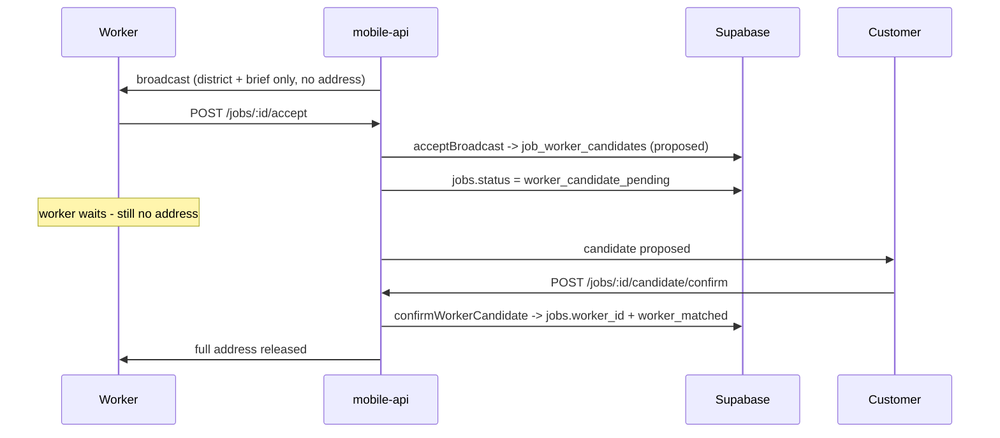

# Structures Spoke - Worker Workflow (B0-B8)

> Extracted from `STRUCTURES.md` section 7 for progressive disclosure (2026-06-24). The hub keeps sections 0-4 plus the spoke routing table; load this spoke for the worker workflow. `RULES.md` and `critical.md` remain higher authority; if this conflicts with them or with Tu, stop and ask.

## 7. Worker Workflow

### Worker Workflow Illustration

```text
Worker opens app
-
|- chooses worker role first
|- signs in with current Supabase email/password auth in Phase 0
|- phone OTP is a later production-auth upgrade after SMS provider setup
|- submits identity + skill info
|- waits for admin approval
|- turns online
|- receives matching job
|- sees general area + Kael pre-brief
|- accepts within 60s as a candidate
|- waits for customer confirmation of the proposed match
|- full address revealed only after customer confirmation
|- updates job status
|- chats with customer
|- requests scope change if issue differs
|- waits for the validated Kael scope proposal and explicit customer decision
|- completes job with notes/photos
|- earnings updated only after customer completion confirmation and verified payment state
```

### 7.0 How to read a step

Same two-block shape as `customer-workflow.md` §6.0: **Contract** is product law, **Runtime** describes what executes today and is anchored on function names. Paths are relative to `supabase/functions/mobile-api/_shared/`.

The worker app is stage-driven: 5 sections over 30 numbered stages (`1.1-worker-home` … `5.14-worker-policies`), owned by `apps/mobile/components/worker/dock/screens.ts`. The B-steps below are workflow steps, not screens — one B-step can span several stages.

### 7.0.1 The accept → candidate → confirm handshake

The single most misread part of the worker flow: **accepting does not assign the job.**



If the customer rejects, `rejectWorkerCandidate` returns the job to `broadcasting` and the address is never released. `jobs.worker_id` is written in exactly one place: `confirmWorkerCandidate`.

### 7.0.2 Worker route tree

Every `Trigger` line below names a file in this tree. The four docked screens sit under a `(tabs)` group; chat is pushed over the dock rather than switched to.

```text
app/(worker)/
  _layout.tsx          Stack: hosts (tabs), pushes chat
  (tabs)/
    _layout.tsx        Slot + WorkerRebuildDockOverlay, wrapped in WorkerDockLayoutProvider
    home.tsx           -> WorkerHomeSurface
    jobs.tsx           -> WorkerJobsSurface
    earnings.tsx       -> WorkerEarningsSurface
    profile.tsx        -> WorkerProfileSurface
  chat.tsx             pushed, not a tab
  jobs-prototype.tsx   prototype route, never reachable from production navigation
```

**There is no `Tabs` navigator**, the same as the customer side. The active dock entry comes from `resolveWorkerV5DockActive(pathname, params)`, not from a navigator's own state.

### B0. Worker Registration

```text
Purpose
-
|- collect worker identity and skill information

Input
-
|- email/password auth in Phase 0
|- phone OTP later when SMS provider is enabled
|- legal name
|- date of birth
|- gender optional
|- service skills: electrical / plumbing / cleaning / HVAC / upholstery / handyman, including verified multi-service combinations
|- years of experience
|- working districts
|- CCCD front/back
|- selfie with CCCD
|- bank account

Rules
-
|- worker cannot receive jobs before approval
|- PII must never be logged
```

**Runtime**

```text
Trigger   workers.register - POST /workers/register - workerService.register
Chain     registerWorker / submitWorkerApplication (domains/worker/registration.ts)
Media     apps/mobile/lib/worker-verification-upload.ts uploads CCCD/selfie into the
          PRIVATE worker-verification storage box; the row stores refs, never the files
Writes    worker_profiles (verification_status='submitted'), worker application row
Gates     six-service skill list validated against shared constants; PII never logged
          (RULES.md #9) - the registration payload is scrubbed before any log line
Fails as  VALIDATION 400 - AUTH_FORBIDDEN 403 (wrong role)
```

### B1. Admin Approval Required

```text
Purpose
-
|- manually verify worker trust before marketplace access

Admin checks
-
|- identity
|- skill category
|- working area
|- bank information
|- suspicious duplicate accounts

States
-
|- submitted
|- under_review
|- approved
|- rejected
|- suspended
```

**Runtime**

```text
Trigger   none in-app - there is NO admin approval endpoint
Chain     approval is performed directly against Supabase, outside the product
Reads     workers.me - GET /workers/me - getWorkerProfile returns verification_status
          so the worker surface can show an honest blocked state
Gates     an unapproved worker is excluded by queryEligibleWorkers, so approval is
          enforced at matching time, not only in the UI
```

**This is the PARTIAL in `STRUCTURES.md` §1.5.** `domains/admin/` contains one file (`learning.ts`) and none of the 8 `admin.*` route kinds cover worker approval. Until that ships, B1 is a manual DB operation.

### B2. Worker Home

```text
Purpose
-
|- control availability
|- show daily activity

UI
-
|- online/offline toggle
|- jobs today
|- earnings today
|- average rating
|- incoming job card
|- tabs: Home / Jobs / Chat / Earnings / Profile
```

**Runtime**

```text
Trigger   app/(worker)/(tabs)/home.tsx -> WorkerHomeSurface (stage 1.1-worker-home)
Chain     workers.me           GET   /workers/me                 getWorkerProfile
          workers.availability PATCH /workers/me/availability     updateWorkerAvailability
          workers.serviceArea  PATCH /workers/me/service-area     updateWorkerServiceArea
          workers.servicePreferences PATCH .../service-preferences updateWorkerServicePreferences
          workers.activityMinute                                  recordWorkerAppActiveMinute
          workers.performanceInsights                             getWorkerPerformanceInsights
Writes    worker_profiles.is_available, service area, service preferences
Gates     availability toggle is guarded (#109): a worker with an active job or a locked
          service quality state (isWorkerServiceQualityLocked) cannot go online freely
Honest    "earnings today" and "average rating" must come from real rows; there is no
          actor-stats reader wired (STRUCTURES.md section 1.5), so a surface that needs
          those numbers shows an empty state rather than a zero
```

### B3. Incoming Job Request

```text
Purpose
-
|- allow worker to accept or skip quickly; acceptance proposes a candidate and does not finalize assignment

Content before accept
-
|- service type
|- general district/area
|- Kael pre-brief
|- estimated customer price range
|- estimated worker earning
|- 60s countdown

Hidden before accept
-
|- full apartment address
|- customer phone
|- exact unit number

Events
-
|- job_request_sent
|- worker_accepted
|- worker_candidate_proposed
|- worker_declined
|- request_expired
```

**Runtime**

```text
Trigger   workers.broadcasts - GET /workers/me/broadcasts - listWorkerBroadcasts
          (domains/worker/broadcasts.ts); push arrives via device_push_tokens
Accept    jobs.accept  - POST /jobs/:id/accept  - acceptBroadcast (domains/matching/accept.ts)
Decline   jobs.decline - POST /jobs/:id/decline - declineBroadcast (domains/matching/decline.ts)
Writes    accept: job_worker_candidates (proposed) + jobs.status='worker_candidate_pending'
          + persistWorkerBriefGuidanceAfterAccept. decline: broadcast row -> declined
Emits     'worker_accepted' / 'worker_declined' + customer notification
Gates     the accept is an atomic claim - two workers racing the same broadcast produce
          exactly one candidate; the loser gets a conflict, not a duplicate assignment
Hidden    the broadcast payload carries district + kael_worker_brief_core only.
          Full address, customer phone, and unit number are NOT in the response.
Fails as  INVALID_STATUS 409 (broadcast expired or already claimed) - NOT_FOUND 404
```

Acceptance produces a **candidate**, never an assignment — see §7.0.1.

### B4. Job Detail After Customer Confirms Candidate

```text
Purpose
-
|- give worker full context only after both worker acceptance and customer confirmation

Content
-
|- full address
|- customer display name
|- problem details
|- photos/videos
|- Kael full brief
|- route button
|- chat button

Rules
-
|- reveal only necessary PII
|- full details only after customer confirms the accepted candidate
|- if the customer declines, return the job to matching without revealing exact address or customer PII
```

**Runtime**

```text
Trigger   workers.jobs - GET /workers/me/jobs - listWorkerJobs; jobs.get for the detail
Address   projectAddressAccess (domains/worker/apartment-access.ts) decides what the worker
          may see. Before customer confirmation it projects the coarse view; after
          confirmation buildAuthorizedReleaseAccessState releases the exact address.
Route     workers.routePreview / workers.routeMap - getWorkerRoutePreview / getWorkerRouteMap
          (domains/worker/route.ts) - map keys stay server-side; mobile has no map SDK,
          so the surfaces are SVG (STRUCTURES.md section 1.5)
Chat      jobs.messages.list / jobs.messages.send, same guard as the customer side
Gates     requireJobAccess + the address projection - the privacy boundary is enforced in
          the projection function, not by hiding a field in the UI
```

### B5. On-Site Status Updates

```text
Purpose
-
|- keep customer informed
|- create operational evidence

Statuses
-
|- on_the_way
|- arrived
|- inspecting
|- repairing
|- completed_by_worker

Events
-
|- worker_status_updated
|- customer_notification_sent
```

**Runtime**

```text
Trigger   jobs.status - PATCH /jobs/:id/status - updateJobStatus (domains/job/status.ts)
Chain     validateWorkflowTransition({ event: 'worker_status_advanced', from, to })
          -> one step at a time: worker_matched -> worker_on_way -> arrived -> inspecting
             -> repairing. Skipping a step is rejected, not silently collapsed.
Check-in  jobs.accessAuthorize - POST /jobs/:id/access/authorize - authorizeApartmentAccess
          + requireAttachedCheckInMedia (domains/job/status-check-in.ts):
          the lobby photo is uploaded while status is still worker_on_way, and the flip to
          'arrived' happens only after the upload succeeds. Media stage 'access_check_in'
          therefore allows both worker_on_way and arrived (retry after partial failure).
Geofence  ACCESS_GEOFENCE_RADIUS_KM bounds where a check-in may be claimed
Writes    jobs.status + the stamped timestamp column (arrived_at, ...); job_media_assets
Emits     'worker_status_advanced' + customer notification
Fails as  INVALID_STATUS 409 (illegal pair) - VALIDATION 400 (missing check-in media)
```

### B6. Scope Change Request

```text
Purpose
-
|- handle difference between initial estimate and real on-site issue

Worker input
-
|- real issue description
|- reason
|- optional photo evidence

Rules
-
|- worker does NOT propose price; Kael computes new estimate from worker reported scope (Phase 2.0 2026-05-23)
|- worker cannot continue changed work until Kael emits a validated scope proposal and the customer explicitly confirms it, or an admin override resolves a dispute
|- Kael computes + explains the change to the customer, with confirm/reject/appeal paths
|- all scope change data is logged
```

**Runtime**

```text
Trigger   jobs.scopeChange - POST /jobs/:id/scope-change - requestScopeChange
Chain     request.ts validates description + reason + evidence refs
          (validateScopeChangeEvidenceRefs) - there is no price field in the payload
          -> jobs.status='scope_change_pending' blocks changed work at the status level
          -> Kael computes the new estimate; the customer decides via scope.decide (A11)
Assist    jobs.kaelIncidentOpen / kaelIncidentGet / kaelIncidentProposeScope
          (domains/job/incident*.ts) give the worker Kael help while on site
Signal    getWorkerScopeChangeRate feeds a matching penalty, NOT an automatic suspension
          - autonomous worker punishment is forbidden (do-not-build-now.md section 21)
Fails as  VALIDATION 400 (evidence refs) - INVALID_STATUS 409 (wrong status)
```

### B7. Complete Job

```text
Purpose
-
|- worker submits completion evidence

Input
-
|- completion note (required)
|- completion photos (>= 1 required)

State
-
|- completed_by_worker
|- awaiting_customer_completion_confirm
|- confirmed_by_customer or disputed

Rules
-
|- worker does NOT enter final price; Kael-locked value is authoritative (Phase 2.0 2026-05-23)
|- final price source: jobs.final_price (set at the confirmed A7 offer baseline or latest customer-confirmed A11 Kael-computed scope proposal)
|- payment cannot start until the customer explicitly confirms completion and the server validates the completion decision
```

**Runtime**

```text
Media     jobs.mediaUpload - POST /jobs/:id/media-upload - createJobMediaUpload returns a
          signed upload intent; jobs.media - POST /jobs/:id/media - attachJobMedia records
          it with stage='after'. jobs.mediaRevoke - revokeJobMediaUploads undoes a draft.
Status    jobs.status - PATCH /jobs/:id/status - updateJobStatus with
          event 'worker_completed' (repairing -> completed_by_worker)
Writes    job_media_assets (stage='after'), jobs.status + completed_at
Gates     media stage 'after' is legal only while status is repairing or completed_by_worker
          - the worker cannot pre-upload completion photos earlier
No price  the payload has no final-price field; jobs.final_price stays Kael-locked
Fails as  INVALID_STATUS 409 - VALIDATION 400 (missing note or photo)
```

### B8. Earnings

```text
Purpose
-
|- show transparent worker economics

Content
-
|- gross service amount
|- platform fee
|- worker net earning
|- job history
|- withdrawal controls only when a real rail is implemented; otherwise an honest unavailable state

Rule
-
|- earnings finalization depends on Kael completion/payment decision and provider capability
```

**Runtime**

```text
Trigger   workers.earnings - GET /workers/me/earnings - getWorkerEarnings
          (domains/worker/earnings.ts)
Source    the commission ledger written by domains/payment/commission.ts from the
          Kael-locked final price; gross, platform fee, and net are derived there
Cash      confirmWorkerCashPayment (domains/payment/cash.ts) is the worker-side cash
          confirmation that moves confirmed_by_customer -> paid
Honest    there is no withdrawal rail; the surface must show an unavailable state rather
          than a disabled button implying one exists. No payout number is rendered for a
          job that has not reached a verified paid state.
```

### B6b. Worker Cancellation

Worker-initiated cancellation is a sibling of the scope-change flow and lives in the same surface.

```text
Trigger   jobs.workerCancellation - POST /jobs/:id/worker-cancellation
          - requestWorkerCancellation (domains/worker/cancellation.ts)
Decide    POST /worker-cancellations/:id/decide - decideWorkerCancellation
Chain     the decision becomes a KaelAutonomyDecision with
          reference_id "docs/workflow/worker-cancellation.md" in its evidence set
Result    kael_processed_cancellation returns the job to 'broadcasting' (re-match) or
          'cancelled'; it is the ONLY event that can pull an active on-site job back
Forbidden no autonomous suspension, rating penalty, payment hold, or punishment
```

The policy contract is [`docs/workflow/worker-cancellation.md`](../../docs/workflow/worker-cancellation.md). **That file is load-bearing at runtime** — its path is a string literal in `domains/worker/cancellation.ts`, used as policy-evidence `reference_id`. Do not move, rename, or delete it.

---

## Where this maps in code

Per-step owner files live in [`docs/architecture/code-ownership-map.md`](../../docs/architecture/code-ownership-map.md). This spoke owns the workflow contract and runtime call order; that map owns which file to open.
